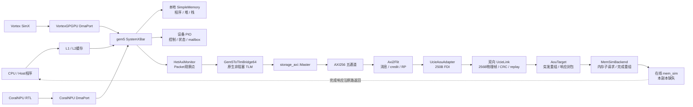

# 01：整体架构与运行模式

> 本文保存在线 Ramulator2 替代实施前的静态分析与方案；当前已实现代码、接口和运行配置见[在线后端说明](../ramulator-integration.md)。

## 1. 项目整体作用

StorageStacked 统一系统把异构计算侧、片间传输侧和存储侧放进同一仿真时间线，研究访存的功能正确性、协议映射、带宽、排队、反压、错误重放和下游延迟反馈。

它适合回答：写掩码经过封包与解包是否仍然正确；窄访问如何落在 AXI256 的字节 lane；多个未完成请求如何保持关联；UCIe 误码和重放是否改变数据；内存变慢是否让 CPU/GPU/NPU 的完成时间变晚。它不是直接部署在真实硬件上的运行系统，也不包含完整操作系统、通用缓存一致性或完整 GPU RTL。

实际总装配源码是 [`gem5_axi/aou_backend.cc`](../../gem5_axi/aou_backend.cc)，完整 XPU 配置是 [`gem5_axi/configs/run_xpu.py`](../../gem5_axi/configs/run_xpu.py)。

## 2. 在线主链路



图中的返回箭头是简写。实际返回经过 `MemSimBackend → AouTarget → UcieLink reverse → UcieAouAdapter → FlitUnpacker → AXI B/R → Master → TLM BEGIN_RESP → gem5 Packet response → 原设备`。

CPU 缓存层属于 `run_xpu.py` 复用的 `het_system.py::build_cpus()`；`run.py --mode cpu` 的较小 CPU 测试配置直接连接 CPU 到 `SystemXBar`，没有这套 L1/L2。两种配置不能混为相同拓扑。

## 3. 每层负责什么

| 层 | 核心目录/代码 | 输入 | 输出 | 本层决定的行为 |
|---|---|---|---|---|
| Host 执行 | `gem5/src/cpu`、workloads | x86 程序、PIO 控制 | Packet、任务启动 | 指令执行、同步、校验 |
| GPU 模型 | 外部 Vortex、`gem5_new/vortexint` | kernel、CP 队列 | core/CP 访存回调 | GPU/CP 执行与等待 |
| NPU 模型 | `coralnpu/hdl`、`coralnpuint` | RISC-V ELF、启动、完成注入 | RTL AXI 握手后的回调 | RTL 每周期计算、TCM、外存停等 |
| gem5 设备壳 | `gem5_new/gem5int/src/dev` | C ABI 回调、PIO | DMA Packet、库 completion | 地址转换、事务存活、事件调度 |
| 互连 | `SystemXBar` | CPU/DMA Packet | 对应 responder | 地址路由、仲裁、传输延迟 |
| 统一观察 | `HetAxiMonitor` | 已接受 Packet / response | 分源 HETTrace | 来源归类、合成 AXI 记录，不存真实内存 |
| TLM 适配 | `gem5/src/systemc/tlm_bridge` | Packet timing 协议 | 四阶段 TLM | 请求/响应排他、retry、payload 生命周期 |
| AXI 主设备 | `gem5_axi/axi_master.cc` | TLM payload | AXI 五通道 | 拆 burst、ID 分配、lane、真实握手 |
| AoU 发起桥 | `axi2flit/systemc` | AXI AW/W/AR | FlitTransfer；AXI B/R | 编码、RP 队列、credit、跨帧 |
| UCIe 链路 | `ucie-model/src` | FdiFlit | 对端 FdiFlit | 串行化、行为 PHY、CRC、ACK/NAK、重复丢弃 |
| AoU 接收端 | `aou_target.h` | 请求 Flit、内存 response | 整笔内存 request、响应 Flit | AW/W 重组、槽位预约、完成 ticket |
| 在线内存桥 | `memsim_backend.cc` | SimpleMemRequest | SimpleMemResponse | 边界拆分、提交反压、子请求回收 |
| 内存模型 | `mem_sim`，缺失 | `ss_mem_submit` | `ss_mem_pop` | 真实数据存储、内存服务时序，内部本次不可核实 |

## 4. 控制面、数据面、观察面

**控制面**：Host 经 MMIO/PIO 配置 Vortex CP、启动 NPU、读取状态和 mailbox。控制窗口由设备 SimObject 响应；它们没有全部穿越 UCIe 到内存。

**数据面**：Host 写共享区/BAR，GPU core 和 CP DMA、NPU 外部 DDR 访问经目标内存桥进入链路，真实 WDATA/RDATA 和掩码沿途搬运。只有这一部分数据受在线后端反馈。

**观察面**：Packet monitor 写合成 HETTrace；`Demo::sample()` 写真实 AXI 握手和 VCD；UCIe observer 写两端完整帧；MemSimBackend 写子请求事件；离线 checker 对这些独立证据交叉核对。观察记录不应代替数据通路。

## 5. 三种保留的在线后端组合

[`run.py`](../../gem5_axi/configs/run.py) 有两层选择，默认值并不是完整链路。

| `--backend` | `--memory-backend` | 路径 | 用途 |
|---|---|---|---|
| `ram`，默认 | `simple`，默认 | TLM → AXI256 → `Ram` | 验 TLM/AXI 转换、协议与基本数据 |
| `aou` | `simple` | TLM → AXI256 → AoU → UCIe → `SimpleBurstMemory` | 验封包、链路、重放与定延迟反馈 |
| `aou` | `memsim` | TLM → AXI256 → AoU → UCIe → `MemSimBackend` → 在线 `mem_sim` | 完整目标链路 |

`--memory-backend memsim --backend ram` 在参数解析时拒绝。`run_xpu.py` 直接固定 `backend='aou'` 和 `memory_backend='memsim'`。

配置上可选择 RAM，并不意味着当前构建可以绕过缺失 mem_sim：`env/build.sh` 默认全源检查且先构建 mem_sim，`gem5_axi/SConscript` 无条件编译 MemSimBackend 并链接其库。

## 6. 旧异构功能路径与离线重放

`gem5_new/gem5int/configs/het/het_system.py` 保留另一套可执行配置：

```text
CPU / GPU / NPU
    → gem5 membus
    → HetAxiMonitor
    → memory_bus
    → host SimpleMemory / UnifiedTimingMemory
    → HETTrace 文件
    → hettrace convert --preset memsim
    → 外部 hbm_sim 离线重放
```

这里设备仍等待 gem5 功能内存 response，功能层是有反馈的；但后来离线 hbm_sim 的完成不会重新送回已经结束的设备执行。因而离线存储参数改变的是固定请求流的服务结果，不能据此得到这些参数下新的应用运行时间。

在线入口 `run_xpu.py` 只复用其中 `build_cpus/build_npu/build_vortex/host_env/map_device_windows`，并没有调用 `build_memories()`，因此没有把 `UnifiedTimingMemory` 串进完整 UCIe 数据通路。

旧文档的 open-loop 限制适用于这套离线实验；不能据此断言当前在线源码也没有 completion 反馈。

## 7. 四种“内存”必须区分

| 名称 | 数据和时间职责 | 当前接线位置 |
|---|---|---|
| gem5 `SimpleMemory` | Host 本地实际字节、固定功能延迟 | 在线主链路旁边的主存 |
| `UnifiedTimingMemory` | 4 KiB 稀疏页、掩码写、功能延迟/带宽 | 旧 `het_system.py` 的共享 responder |
| 在线 `mem_sim` | C ABI 所要求的数据与 completion 服务 | 完整 UCIe 链路终点，源码缺失 |
| 根目录 `ramulator2` | DRAM 请求/命令时序、调度、功耗及可视化 | 独立模拟器，未替换 MemSimBackend |

另有 Vortex `third_party/ramulator`，属于外部 SimX 构建依赖。不能因三个名称相似就认定为同一库。

## 8. 时间与进程架构

统一仿真由 `m5.simulate()` 驱动。gem5 原生 SystemC scheduler 使用 gem5 event queue；SystemC `SC_THREAD/SC_METHOD` 的等待和 delta 调度不是另一个宿主仿真进程。

Vortex 动态库是 C++ SimX，CoralNPU 动态库是 Verilator 原生 C++ 模型；gem5 通过 `dlopen/dlsym` 调用扁平 C ABI，避免把 Bazel/Verilator 或外部 C++ 类型泄漏进 SCons 世界。CoralNPU 统一构建明确传 `--define=storagestacked_native_cpp=1`。

在线入口在创建 SystemC 时间对象之前选择 `10^15 tick/s`，即每 tick 为 1 fs，并多处断言 `sc_time_stamp().value() == gem5::curTick()`。不同组件可以有不同周期，统一时间单位不等于统一时钟频率。

## 9. 目录维护与源码归属

| 目录 | 实际维护方式 | 阅读时的地位 |
|---|---|---|
| `env` | 主仓库脚本、锁文件 | 唯一统一环境/构建/验收入口 |
| `protocol/include` | 主仓库公共头 | 两端物理帧布局共同契约 |
| `gem5_new` | 主仓库源码 | 设备适配、HETTrace、负载与旧功能路径 |
| `gem5_axi` | 主仓库源码，gem5 EXTRAS | 原生 TLM/AXI 与在线总装配 |
| `axi2flit` | 主仓库源码 | AoU 协议桥、集成端点与测试 |
| `ucie-model` | 主仓库源码 | 可复用双向链路与行为 PHY |
| `gem5` | 主仓库普通目录 | 执行和事件框架，含原生 SystemC |
| `coralnpu` | 主仓库普通目录 | Chisel/RTL 与 Verilator 仿真 |
| `ramulator2` | 主仓库普通目录 | 独立 DRAM/功耗模拟器 |
| `vortex-gpu/vortex` | 唯一直接外部子模块及递归依赖 | GPU 上游，锁定 `d76b7f24e658867ab57e3942d7c648c3e6af072d` |
| `mem_sim` | 当前缺失 | 必须补齐匹配实现才能完成现有在线构建 |

gem5 设备源以 `gem5_new/gem5int/src/dev` 为真源，安装脚本刷新 `gem5/src/dev` 构建副本；CoralNPU 的 `gem5int` 库 package 同样由系统内真源生成。阅读两份相同文件时不应把它们理解为两套独立设备。

## 10. 启动到收尾的完整生命周期

1. bootstrap 安装锁定工具与缓存，activate 设置统一路径。
2. check_sources 检查普通源码归属和外部 revision。
3. XPU 安装复制设备库源，Vortex 在外部树应用在线适配补丁；主仓库 gem5/CoralNPU 基础适配直接维护。
4. 各构建系统产出 GPU/NPU 共享库、Host/NPU kernel、在线内存库和 gem5 可执行文件。
5. Python 配置创建 SimObject、时钟、范围和连接；`m5.instantiate()` 建立对象与端口。
6. startup 加载动态库/内核；UCIe 训练，Demo 等待链路可用后释放 AXI reset。
7. Host 写输入和控制寄存器；gem5 事件交错推进设备、AXI、链路和内存。
8. 各请求在服务完成后沿返回路径退休；Host 核对真实结果和 mailbox。
9. `system.axi.finish()` 刷日志、补 VCD 最后边沿并写摘要；独立 checker 解码、重建字节和检查因果。
10. HTML 从分块数据按需读取，验收汇总关联程序、协议、链路、内存与反馈证据。
