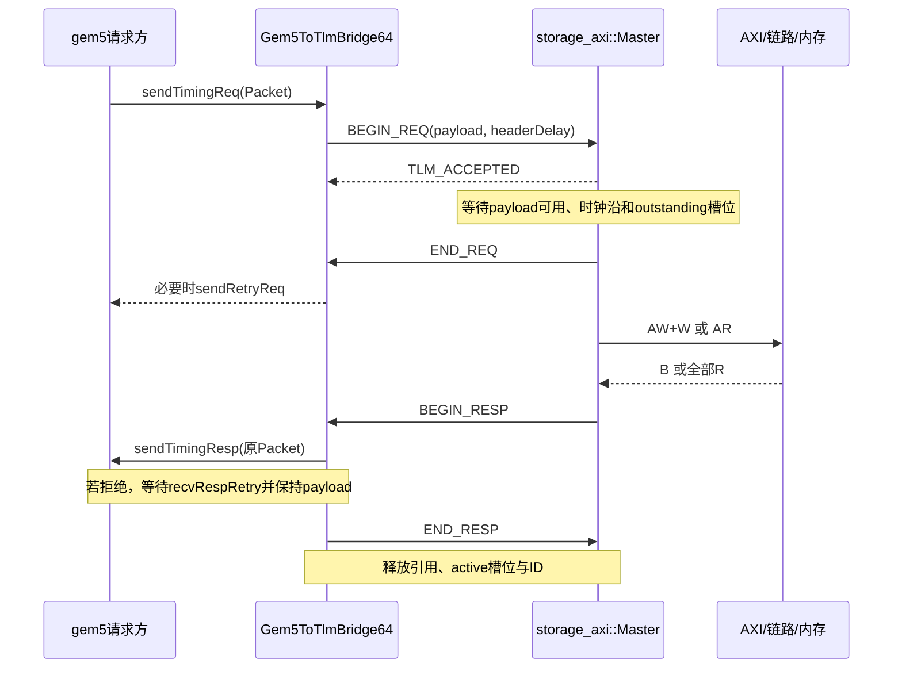

# 02：接口、地址、时间与顺序契约

> 本文保存在线 Ramulator2 替代实施前的静态分析与方案；当前已实现代码、接口和运行配置见[在线后端说明](../ramulator-integration.md)。

## 1. 前后接口总表

| 上游 → 下游 | 接口与主要字段 | 接受语义 | 完成与反压 |
|---|---|---|---|
| Host → 设备 | PIO Packet，地址、32 位寄存器值 | PIO 请求被设备处理 | 返回 PIO response/latency；状态轮询是程序行为 |
| CoralNPU RTL → 库 → SimObject | `timing_read(ctx,addr,axi_id,size)`；`timing_write(...,src,strb,size)` | RTL address/data 握手后 issue | 后续 `complete_read/write` 才注入 RTL R/B |
| Vortex core → SimObject | issue callback，`token,addr,is_write,src,byteen,size` | callback 返回 bool | `complete_core_memory(token,read_data,size)` 才释放等待 |
| Vortex CP → SimObject | 同步外观的 memory callback + gem5 coroutine | 入 DMA queue 并 yield | 完成后恢复 CP continuation，不在回调里推进仿真时间 |
| SimObject/CPU → gem5 XBar | RequestPort，`sendTimingReq(PacketPtr)` | 返回 true 才接受 | false 保留 Packet 等 `recvReqRetry`；response 也有 retry |
| Monitor → TLM bridge | 透明 gem5 Packet forwarding | 下游接受后记 begin | 上游接受 response 后记 complete，避免重复计数 |
| TLM bridge → AXI Master | `tlm_generic_payload` + RequestAttributes extension | `BEGIN_REQ` 后等待 `END_REQ` | `BEGIN_RESP/END_RESP` 表示响应交付完成 |
| AXI Master → AoU Fabric | AXI256 五通道 sc_signal | 时钟沿 `VALID && READY` | VALID 被阻塞时 payload 必须保持；B/R 返回状态与数据 |
| Axi2Flit → adapter | `FlitTransfer{valid,flit}` + `flit_ready` | 已公布 ready 对应的时钟沿 | 下游不 ready 时整帧保持 |
| adapter ↔ UcieLink ↔ target | 四个 `sc_fifo<FdiFlit>` 端口 | FIFO 成功写入 | 有界队列满后阻塞/不给 ready |
| AouTarget → 内存桥 | `sc_fifo<SimpleMemRequest>` | 整笔请求入 FIFO | `SimpleMemResponse` 才是内存完成 |
| MemSimBackend → mem_sim | `ss_mem_submit(id,addr,n,write,data,mask)` | 正返回/true 接受，0 为反压，负值为错误 | step 推进一内存周期；pop 回收 completion |
| C++ writer → Python 工具 | HETTrace 文件头 64B + Record 56B，meta JSON | 持久化记录 | 文件尾/序号/meta 检查截断，不能作真实数据 completion |

## 2. gem5 Packet 契约

`Request` 描述地址、大小、访问属性、requestor、stream/substream、byte-enable；`Packet` 额外持有命令、真实数据、响应状态、header/payload delay 和 SenderState 链。

RequestPort 的请求返回 false 时，下游没有接受该次事务。发送者必须持有原 Packet，收到 retry 通知后再提交；不能生成另一个独立请求把原始请求遗忘。响应端同样需要在上游拒绝时保持 Packet 与关联上下文。

`HetAxiMonitor` 把 TraceSenderState 放进原 Packet 的 SenderState 链；TLM bridge 的 `packetMap` 将 payload 指针映射回原 Packet；DMA completion 使用设备自有 token/sequence。它们分别服务各层关联，不能互相代替。

## 3. TLM 四阶段与生命周期



`BEGIN_REQ` 表示提出请求；`END_REQ` 释放请求排他性，不意味着读数据已经回来。Master 在 `END_RESP` 才删除 active、递增 completed 并 `gp.release()`。因此响应反压会继续占用事务槽和 wire ID。

Master 使用 memory-managed payload，进入 BEGIN_REQ 时 acquire，结束时 release；bridge 也持有相应引用。byte-enable 的 backing storage 在 RequestAttributes extension 内存活，不能传一个回调栈上的短命数组。

TLM socket 模板宽度为 64，但 `gp.get_data_length()` 可以是更大字节数。真实 AXI 宽度独立来自 `DataBits=256`。

## 4. Packet → payload 的附加属性

[`axi_demo.cc`](../../gem5_axi/axi_demo.cc) 注册 conversion hook：

- 将 `Request::getByteEnable()` 复制为 `0xff/0` 数组并设置 TLM byte-enable pointer/length。
- 保存 `requestorId`、可选 stream/substream，供事务日志与设备关联分析。
- 保存 Packet 的 `payloadDelay`，因为原生 bridge 随后会清掉 Packet delay。
- atomic op、LL/SC、locked RMW、swap、cache maintenance 转为 IGNORE command，防止当普通读写处理。

Master 的 `pendingAt` 为请求注释开始时间加 payloadDelay，并保守地等到后续时钟沿再接受。属性出现在 `transactions.csv`，并非自动完整编码进 AoU USER/QOS。

## 5. AXI256 信号契约

来源：[`axi_signals.hh`](../../gem5_axi/axi_signals.hh)、[`axi_if.h`](../../axi2flit/systemc/include/axi_if.h)。

| 通道 | 方向 | 关键字段 | 意义 |
|---|---|---|---|
| AW | Master → Slave | `awaddr[63:0], awid[15:0], awlen[7:0], awsize[2:0], awburst[1:0]` | 写地址和突发几何 |
| W | Master → Slave | `wdata[255:0], wstrb[31:0], wlast` | 写数据和每字节使能；没有 WID |
| B | Slave → Master | `bid[15:0], bresp[1:0]` | 整笔写完成状态 |
| AR | Master → Slave | 同 AW 的读版 | 读地址和突发几何 |
| R | Slave → Master | `rid[15:0], rdata[255:0], rresp[1:0], rlast` | 每个读拍的数据和状态 |

每通道都有各自 `valid/ready`。`AxLEN+1` 是拍数，`1<<AxSIZE` 是每拍有效传输字节数；32B full beat 的 SIZE 为 5。

AoU wire ID 只有 10 bit，集成模式设 `maxId=1023`，活跃 ID 使用 1..1023。内部 AXI signal 的 16 bit 不代表在线链路支持 65535 个不同活跃 ID。RP 字段为 2 bit，最多 4 个资源平面。

当前声明的请求子集：INCR、按每拍大小对齐、burst 不跨 4 KiB、每 burst 至多 256 拍、大小不超过本地总线。Master 会把原始非对齐访问和较大 Packet 拆成符合子集的小 burst；AoU 入口遇到仍不合法的 burst 会显式报错。

## 6. 窄访问与 byte lane

统一公式：

```text
beat_address = burst_address + beat_index × (1 << AxSIZE)
lane         = beat_address % 32
payload_offset = segment_offset + beat_index × beat_bytes + byte_index
bus_byte     = lane + byte_index
WSTRB[bus_byte] = original_byte_enable[payload_offset]
```

例如在 `0x90000014` 写 4B：SIZE=2，lane=20，真实数据进入 WDATA 字节 20..23，WSTRB 使能这四个位置。上游若屏蔽第二字节，对应 WSTRB[21]=0。不能把四字节直接放在 lane 0。

NPU timing seam 当前以对齐 16B 窗口发 DMA：`0x90000010` 对应 AXI256 lane 16..31，并非 NPU 自身 RTL 已变成 256 bit。Fabric 两端都是 32 字节 lane 数组，直接逐 lane 转换；这里没有额外的窄化或地址移位。

## 7. 各层 ID 及其复用

| 名称 | 分配者 | 作用域 | 退休时机 |
|---|---|---|---|
| NPU native AXI ID | RTL | 原始 NPU AXI | 设备壳按 ID 内 sequence 队列完成注入 |
| NPU sequence / GPU token | 设备适配/SimX | 某设备当前活跃请求 | DMA 完成并通知设备模型 |
| Master wire ID | Master::admit | 当前 TLM active | TLM END_RESP |
| HETTrace txn / synthetic ID | writer/monitor | 每个源文件 / 活跃 Packet | monitor completion 与 ID 释放 |
| UCIe seq / transaction_id | 链路 Tx / AoU adapter | 每个传输方向 | seq 用 ACK/NAK；transaction_id 主要作观察元数据 |
| mem child ID | MemSimBackend | 原生内存提交 | ss_mem_pop 匹配后回收 |

不能仅用 AXI ID 区分整次运行中的所有事务，因为 ID 会复用。checker 用事务时间区间和序列关联；跨源 HETTrace 用 `(src_id,txn)`。

## 8. AoU message 编码

MsgBuilder 使用 BitWriter 按 MSB-first 写位域。数组 `data[j]` 是总线第 j 字节，线上多字节字段按编码器指定顺序；离线日志有的把宽数据高字节先写，有的按地址递增写。不同日志的 hex 字符串不可未经转换直接相等比较。

| 消息 | AXI 来源 | 256bit 配置下长度 | 携带内容 |
|---|---|---|---|
| WriteReq | AW | 3 granule = 15B | type、RP、lock、USER16、ID10、SIZE3、PROT3、LEN8、CACHE4、QOS4、ADDR64 |
| ReadReq | AR | 15B | 同请求格式 |
| WriteData | W，部分 strobe | 8 granule = 40B | type/RP/DLENGTH、USER、32B data、4B strobe bitmap、补零 |
| WriteDataFull | W，全 strobe | 7 granule = 35B | 省略 strobe，接收时恢复全使能 |
| ReadData | R | 8 granule = 40B | USER、ID、RESP、LAST、32B data |
| WriteResp | B | 1 granule = 5B | USER、ID、RESP |
| Misc CrdtGrant | 流控 | 2 granule = 10B | 多 RP、多消息类别的 credit 授予 |

WriteData wire 不携带 WLAST；发起侧在 AXI 握手时检查 WLAST/AWLEN，接收侧按 AWLEN 重建边界。AXBURST 固定为 INCR，不作为可变支持能力穿越消息。Misc Activation 有长度定义，当前桥没有完整实现其激活流程。

## 9. Flit 三层长度与物理布局

```text
AXI业务消息
  → 240B payload：48 × 5B granule
  → 250B协议内容：10B Protocol Header + 240B payload
  → 256B物理帧：250B协议内容 + 2B FH + 4B CRC
```

Protocol Header 含 FDId、48 bit MsgStart 和 MsgCredit。MsgStart 只标新消息起点；跨帧续传在下帧 G0 开始，接收器使用上帧 carry 状态。`used_granules` 是本地统计辅助字段，没有在线传输；反序列化将其设为 -1，暴露误用。

[`protocol/include/aou_format6.h`](../../protocol/include/aou_format6.h) 规定：FH 位于 byte 0..1；PH 的十个字节位于 62、63、64、65、128、129、190、191、192、193；四段 60B payload 从 2、66、130、194 开始；CRC 位于 126..127 与 254..255。scatter/gather 是两端公共真源。

链路 build_flit 为前后两个 126B 区域计算 CRC16-CCITT。不能用 Standard256 格式的旧 CRC offset 解析 AoU Format6。

## 10. FDI 与业务元数据边界

`FdiFlit` 含 payload、valid_bytes、transaction_id、vc、BusinessKind、transaction_start/fdi_time。AoU 模式严格要求 payload 和 valid_bytes 均为 250。adapter 配置采用 16 lane、24GT/s、NRZ，避免 UCIe 默认 PAM4 使理论速率翻倍。

这些 metadata 由行为模型侧带保存，不受 PHY 误码；实际可能损坏的是物理 Frame.bytes。该模型能验证字节和重放逻辑，但不是所有元数据都被编码成硬件线上协议。

## 11. credit、FIFO 和顺序

AoU credit 表示一个 5B granule 的对端接收空间，按 RP 和消息类型分别记账。发送前扣整条消息 credit，即使消息跨帧；接收空间释放后才能回 credit。请求侧初始公布 RDATA/WRESP 接收容量，target 初始公布 WREQ/RREQ/WDATA 容量。

RDATA/WRESP credit 在 AXI R/B 实际握手之后归还；WDATA 在 target 搬入预留整笔 burst 空间后归还，保证长 burst 不因小窗口死锁；WREQ/RREQ 在成功提交内存请求 FIFO 后归还。

UCIe retry buffer 是另一套资源：它保存未 ACK 的物理传输，用 CRC/seq 和 ACK/NAK 回收。链路 ACK 表示可靠交付到对端 FDI，不代表内存访问完成。

本项目 RP 分离发送/接收队列，但 AXI AW/AR 的 ready 计算仍会保守检查所有 RP 请求 FIFO；因此不能宣称所有层面完全消除了跨 RP 队头阻塞。

`RpOrderGuard` 要求同方向、同 ID 的未完成事务绑定同 RP；读写分别建表，R 最后一拍或 B 握手退休。MemSimBackend 的 burst response 全局 FIFO 顺序比契约要求更强，可能限制跨 ID 乱序潜力。

## 12. 内存请求与子请求

`SimpleMemRequest`：write、RP、完整 AxChannel、write_beats 数组；每个写拍含 32B data、逐字节 strobe、USER。读请求不带 write_beats。

`SimpleMemResponse`：write、RP、ID、写 BRESP/USER、read_beats。读 response 必须携带原请求拍数，每拍含 32B data、RESP、USER。这个接口是整笔 burst 的 FIFO 契约，不是 DFI pin 接口。

MemSimBackend 将 burst 的有效 lane 抽成连续字节数组，转相对地址 `physical-base`，按 `ss_mem_transaction_bytes()` 边界拆子请求；`Child{burst,offset,bytes}` 将 completion 重组回原 burst，再恢复读 lane。

内部 online.h 缺失，`ss_mem_response` 字段和返回语义由现存调用端核实；ABI 布局、数据指针生命周期、具体 DRAM 调度需匹配源码进一步确认。

## 13. 地址空间

完整 XPU 配置：

| 区域 | 基址 | 大小 | 路由和用途 |
|---|---|---|---|
| host_heap | `0x80000000` | 256MiB | 本地 SimpleMemory，SE 普通页池，程序/堆/栈 |
| shared_buffer | `0x90000000` | 256MiB | 目标 bridge，Host↔NPU 输入/输出 |
| vortex_vram，保留视图 | `0xA0000000` | 256MiB | 设备本地地址描述，非主配置独立共享主存 |
| npu_work | `0xB0000000` | 256MiB | 目标 bridge，Host/NPU 工作数据 |
| vortex_bar | `0x100000000` | 4GiB | 目标 bridge，Host↔GPU 同一字节 |
| vortex_cp | `0x20000000` | `0x200` | Vortex PIO，CPU 映射按 4KiB 页 |
| npu_pio | `0x30000000` | 4KiB | NPU PIO，前 0x20 字节有定义寄存器 |
| npu_mailbox，设备视图 | `0xC0000000` | 16B 描述窗口 | 库将非 DDR master 访问映为 mailbox，不走在线内存 |

Vortex `physical=BAR_base+device_address`。CoralNPU 32bit 地址无法直接访问 4GiB 以上 BAR。Host 负责两个设备各自的数据交接，当前负载没有 GPU/NPU 直接同址共享。

带 GPU 时 AxiDemo backing window 为 `base=0x90000000,size=0x170000000`，覆盖到 `0x200000000` 的排他上界；无 GPU 时 size 为 `0x30000000`。实际 CPU 路由范围只包含声明的目标区域，backing window 内的孔洞并不自动成为 CPU 可访问 region。

CPU 小配置 `run.py` 则使用 0..512MiB Host 主存、`0x90000000` 起 16KiB bridge range，而 AxiDemo 默认 backing 为 8KiB，用于让较高地址到达后端并返回越界错误。

`Process.map(VA,PA,size,cacheable=False)` 必须在 instantiate 后调用；MMIO/shared/BAR 均禁止 CPU cache，避免尚未实现的 DMA cache coherence 破坏交接。声明 `system.mem_ranges` 并不等同于建立 responder 或修改 SE 页池。

## 14. 时间基准

| 时钟/量 | 在线配置 |
|---|---|
| 全局 tick | 1fs，`10^15 tick/s` |
| Host 2GHz | 500000 tick/cycle |
| Vortex 1GHz | 1000000 tick/cycle |
| CoralNPU 500MHz | 2000000 tick/cycle |
| AXI 默认周期 | 2ns = 2000000 tick |
| UCIe UI | `10^6/rate_GTps` fs，24GT/s 约 41666.67fs，实际 sc_time 会量化 |
| 内存周期 | `ss_mem_period_fs()`，由 scale 等参数决定 |

addrmap 生成物保留 1ps 常量；monitor::startup 按实际 sim_clock::Frequency 换算 header 的各源周期，并把真实频率传给 writer。在线 validator 明确传 `--ticks-per-second 1000000000000000`。

统一 fs 并不消除 UI 时间量化；理论裸速率是 16×24÷8=48B/ns，256B 的理想串行时间约 5.333ns，实际模拟值需从事件时间计算，不能仅套理论小数。

## 15. 错误与能力契约

结构错误（非法 burst、WLAST、帧大小、MsgStart、未知 completion）通常 fatal；可服务请求的越界返回 DECERR=3，非法 byte lane/独占通常 SLVERR=2；CRC 错误通过链路重放恢复。

Master 会将 B/R 错误设为 TLM error，再由原生 bridge 映为 Packet bad-address/bad-command。CoralNPU 当前 completion 注入调用固定传 RESP=0，Vortex core completion ABI 也没有显式 error 参数，不能宣称所有设备均完整保留后端错误码。

AoU `access()` 明确返回 command error/0B，DMI 拒绝；不能把 RAM drained debug 能力推广为在线 functional/atomic/checkpoint。target 运行期 reset 要求重建完整链路，NPU 只支持一次启动。
