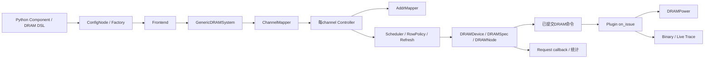

# 04：大型上游源码子系统解读

> 本文保存在线 Ramulator2 替代实施前的静态分析与方案；当前已实现代码、接口和运行配置见[在线后端说明](../ramulator-integration.md)。

本章解释 gem5、CoralNPU、Ramulator2/DRAMPower 的模块组织和实际接缝。目录索引覆盖各源文件与提取到的符号，但本章不是数千上游文件的逐行审计。尤其不能把仓库中存在的架构/设备自动画进当前运行配置。

## 1. gem5：执行、互连与统一时间框架

### 1.1 总体目录职责

| 目录 | 代码作用 | 主要前后接口 | 当前关系 |
|---|---|---|---|
| `src/base` | 日志、统计、地址范围、回调、基础容器/工具 | 全框架通用C++设施 | 链路依赖 |
| `src/sim` | SimObject生命周期、System、Root、clock、event queue、SE Process、syscall、drain/serialize | Python参数→对象；事件→运行；CPU→进程/内存 | 仿真骨架 |
| `src/cpu` | Simple/Timing/O3/Minor/KVM等CPU实现、ThreadContext | ISA指令→cache Packet；completion→后续执行 | 在线CPU实际用TimingSimple |
| `src/arch` | X86/ARM/RISC-V等指令解码、寄存器、MMU与架构语义 | CPU执行引擎→特定ISA | 统一Host构建选X86，不表示所有ISA参与 |
| `src/mem` | Request/Packet/port/XBar/cache/主存/DRAM controller | CPU/设备访存→路由/缓存/responder | 原生Packet数据层 |
| `src/mem/ruby` | Ruby缓存一致性、网络与协议实现 | cache coherence消息 | env构建RUBY=n，非主链路 |
| `src/dev` | PIO/DMA设备框架、总线、中断和设备模型 | MMIO与DmaPort | NPU/GPU构建副本在这里 |
| `src/systemc` | gem5原生SystemC内核、channels、datatype、TLM bridge与测试 | sc_module/TLM→gem5事件 | 统一链路关键，不用第二套SystemC |
| `src/python/m5` | SimObject参数/端口、instantiate/simulate、stats | 配置脚本→C++对象与模拟驱动 | run.py/run_xpu.py使用 |
| `src/python/gem5` | stdlib的board/processor/cache/memory等组合 | 高层配置→m5 SimObjects | 当前主要直接用m5.objects；独立Ramulator可用stdlib |
| `src/proto`、`src/learning_gem5` | protobuf数据定义、教学样例 | 文件/消息和学习对象 | 非在线核心接线 |
| `configs` | 仿真配置与样例，旧/新平台 | 参数→运行拓扑 | 真正在线入口在gem5_axi/configs |
| `build_tools`、`site_scons`、`SConstruct` | 参数代码生成、嵌入Python、构建配置/编译规则 | 源码→gem5 executable | env/build.sh调用 |
| `tests`、`src/**/test*` | 组件与系统回归 | 工具/样例→预期检查 | 文件很多不等于全部执行 |
| `ext` | 额外库/集成与第三方源码 | 构建时依赖或可选适配 | 存在ext/systemc不等于主链路链接独立libsystemc |
| `util`、`system` | m5操作工具、资源/磁盘/运行辅助、平台支持 | 用户程序/系统环境 | 多数不参与当前SE链路 |

### 1.2 CPU 到 Packet 的路径

TimingSimpleCPU 在 instruction/data访问未完成时等待，再由响应事件推进。CPU内部向 icache_port/dcache_port发 Packet；XPU配置的L1/L2处理cacheable Host流量，而显式共享/BAR映射uncacheable后应到达目标responder。

主配置不是FullSystem：`Root(full_system=False,...)`，SEWorkload/Process模拟程序和系统调用。CPU的RequestorID由System分配，monitor依据该requestor名字识别来源。Syscall clone需要空闲CPU上下文，所以Vortex worker要求至少两上下文。

SE ordinary页池由conf_table_reported内存参与建立；XPU配置只有Host页池为普通内存，不能把程序页分进共享目标窗口。Process.map显式建立设备VA/PA映射，路径正确还需XBar下游实际声明对应ranges。

### 1.3 Request、Packet、port 和 XBar

[`src/mem/request.hh`](../../gem5/src/mem/request.hh) 管事务属性；[`packet.hh`](../../gem5/src/mem/packet.hh) 管命令/data/response/SenderState；[`port.hh`](../../gem5/src/mem/port.hh) 定义连接抽象；[`xbar.hh`](../../gem5/src/mem/xbar.hh) 管地址路由和仲裁。

RequestPort是发起方、ResponsePort是接收方；这命名指职责，不指数据只朝一个方向。sendTimingReq/sendTimingResp通过双端互调传原指针，接收者返回bool影响持有与retry。headerDelay/payloadDelay是互连注释延迟，不能在桥接时清掉后假定不存在。

### 1.4 DmaPort 的本地适配

[`src/dev/dma_device.hh`](../../gem5/src/dev/dma_device.hh) 与 .cc 是NPU/GPU壳共用基类。DMA一次调用可以按cache line拆Packet，因此原设备事务必须有持久buffer与done event，不能只根据某一个child Packet响应提前通知设备。

当前导入源码已有byte-enable与stream/substream适配。设备壳调用dmaWrite传掩码，DmaPort按Packet分段设置Request字节使能；TLM conversion hook再把它变为WSTRB，避免在任何层丢掉部分写。

### 1.5 原生 SystemC 为何能共享时间

[`src/systemc/core/kernel.cc`](../../gem5/src/systemc/core/kernel.cc) 在构造中把Kernel的gem5 eventQueue交给scheduler；scheduler.cc/.hh把SystemC process就绪、delta通知、channel update、timeout等排为gem5 events。sc_time.cc的time_resolution使用gem5时钟频率。

所以SystemC wait(2ns)与CPU schedule(clockEdge(...))遵守同一全局时间，适配器中的fs断言可直接比较。SC_THREAD仍有协程状态，但不需要另一模拟器socket或跨进程锁步。

### 1.6 原生 TLM bridge 的逐函数连接

[`src/systemc/tlm_bridge/gem5_to_tlm.cc`](../../gem5/src/systemc/tlm_bridge/gem5_to_tlm.cc)：

| 函数/状态 | 作用 | 与本项目的连接 |
|---|---|---|
| `packet2payload` | 从Packet生成memory-managed generic payload或复用原TLM事务；设置addr/data/length/command，执行附加conversion steps | Demo注册byteEnable/metadata/delay hook |
| `setPacketResponse` | TLM response status→Packet response/error | AXI后端error返回到CPU/tester |
| `recvTimingReq` | 处理blockingRequest排他、Packet delay、BEGIN_REQ状态，保存packetMap | Master::transport接收 |
| `nb_transport_bw` | 把END_REQ/BEGIN_RESP调为gem5 EventFunctionWrapper | 不在任意SystemC回调直接违规跨时序处理 |
| `getPriorityOfTlmPhase` | 同tick END_REQ比BEGIN_RESP优先 | 保持请求状态先释放 |
| `pec` | END_REQ清blockingRequest并发retry；BEGIN_RESP生成Packet response，按上游接受情况END_RESP或blockingResponse | Master::respond→原Packet返回 |
| `recvRespRetry` | 重送blocked response，成功后END_RESP、清map和release | tester response_hold验证 |
| `recvFunctional/recvAtomic` | debug/b_transport兼容入口 | AoU target拒绝该能力，不能把bridge通用接口当后端已支持 |
| `getBackdoor/invalidate_direct_mem_ptr` | DMI/backdoor管理 | Master dmi恒false，正常链路不靠旁路访问 |

bridge width模板有32/64/128/256/512实例，但当前绑定64。选择Bridge256并非自动更改AXI2Flit数据宽度的正确方法；真实AXI位宽来自独立定义。

## 2. CoralNPU：硬件结构与RTL仿真

### 2.1 目录层次

| 目录 | 作用 | 上下游 |
|---|---|---|
| `hdl/chisel/src/coralnpu` | 顶层core、TCM、fabric、CSR、总线适配、标量/浮点/RVV模块 | Chisel配置→RTL生成 |
| `hdl/chisel/src/coralnpu/scalar` | SCore、fetch/decode、register/scoreboard、ALU/branch/mul/div/LSU/fault/debug | 指令→内部ibus/dbus/ebus |
| `hdl/chisel/src/coralnpu/float` | 浮点接口与执行核心 | 标量浮点dispatch/completion |
| `hdl/chisel/src/coralnpu/rvv` | RvvCore/RvvDecode/RvvAlu等矢量连接 | 可选RVV配置 |
| `hdl/chisel/src/bus` | AXI/TL等总线Bundle与转换/arbiter | core/fabric→外部接口 |
| `hdl/chisel/src/common` | FIFO/queue/router/arbiter/aligner/FP公共硬件 | 组合进各执行/总线模块 |
| `hdl/chisel/src/soc`、`peripherals` | SoC交叉开关、TLUL SRAM、外围接口 | 独立SoC集成，不全在当前CoreMiniAxi里 |
| `hdl/verilog` | SRAM、clock/reset与RVV后端SystemVerilog模块/验证 | Chisel生成顶层引用与独立硬件回归 |
| `hw_sim` | Verilator wrapper、clock/AXI driver、mailbox、standalone模拟器 | RTL pin→C++callbacks；complete→RTL pin |
| `rules`、`MODULE.bazel`、`third_party` | Bazel/toolchain/RTL与C++构建规则、第三方依赖 | 编译/生成，不是运行控制器 |
| `tests/cocotb`、`tests/verilator_sim`、`tests/uvm` | kernel、ELF、BFM与硬件验证 | 检验硬件子集与程序功能 |
| `examples`、`sw`、`toolchain` | RISC-V程序、启动/链接、编译器和运行支持 | C/C++kernel→ELF/设备执行 |
| `fpga`、`doc`、`utils` | FPGA工程、硬件资料与开发工具 | 独立实现/维护 |

不同路径的Test/Spec文件是测试，不能依据存在一个Rvv*.sv或矩阵相关目录就宣称当前非RVV验收执行了所有ML硬件能力。

### 2.2 顶层 `Core.scala`

Core的实际IO有CSR/status/irq/debug以及ibus、dbus、ebus和flush。它创建SCore，按p.enableRvv可选RvvCore，与score的rvvcore接口连接；其余instruction/data/external bus和状态从SCore透传。

EmitCore解析生成参数，按useAxi/useTlul选择CoreAxi/CoreTlul或裸Core，用配置生成可被Verilator编译的顶层。生成的CoreMiniAxi不是手工维护一个叫CoreMiniAxi.scala的文件；当前库使用生成类VCoreMiniAxi或VRvvCoreMiniAxi。

### 2.3 `CoreAxi.scala`：内部core与外部AXI的连接

CoreAxi是RawModule，接口有aclk/aresetn、axi_slave、axi_master、boot_addr、irq/status/debug。它实例化reset同步、CSR、clock gate、debug模块、Core、TCM和fabric。

AXI slave主要供外部配置TCM/CSR；AXI master供DDR外存。ITCM路径与非ITCM取指经IBus2Axi路径分离，DTCM/外存经内部fabric和数据总线转换选择。TCM仲裁服务core、AXI slave和debug，局部命中不会都出外部master。

核心接口定义在Interfaces.scala，AXI IO在bus目录；Parameters.scala规定位宽/功能/内存区域。用户看到的统一AXI256是库回调转换成gem5 Packet之后的新总线，不能只改Parameters就等价改变统一总线。

### 2.4 标量及向量执行模块的职责

| 文件/模块族 | 职责 | 连接关系 |
|---|---|---|
| `scalar/SCore.scala` | 标量核总组合 | fetch/decode、执行、CSR、memory/debug |
| `scalar/Fetch.scala`、`UncachedFetch.scala` | 取指和请求/返回组织 | ibus与decode之间 |
| `scalar/Decode.scala` | 指令类别/操作数/执行通道解码 | fetch→regfile/执行单元 |
| `scalar/Regfile.scala`、`FRegfile.scala` | 整数/浮点寄存器存储 | 解码读与退休写回 |
| `scalar/Alu.scala` | 整数算术逻辑 | dispatch操作数→写回结果 |
| `scalar/Bru.scala` | 分支判断/跳转 | dispatch→PC控制/结果 |
| `scalar/Mlu.scala`、`Dvu.scala` | 乘法/除法流水与等待 | 执行结果→退休 |
| `scalar/Lsu.scala` | load/store大小、地址、请求与回传 | 计算侧→dbus/外存适配 |
| `scalar/FaultManager.scala`、`Debug.scala`、CSR相关 | 异常、中断、调试和控制状态 | core状态与外部控制 |
| `float/FloatCore.scala` | 浮点计算路径 | 浮点issue/result接口 |
| `rvv/RvvCore.scala`、`RvvDecode.scala`、`RvvAlu.scala` | 可选矢量执行连接 | SCore可选RVV端口→矢量后端 |

这张表解释模块角色；具体latency、端口数量和支持指令要看Parameters及对应模块，不能把上游README中的一般规格当作当前所有构建变体的实测值。

### 2.5 `hw_sim/core_mini_axi_wrapper.h`

wrapper拥有Verilated core与Clock，slave_read/write_driver用于装载/控制，master_read/write_driver接外存。Step调clock.Step；Reset是本地模型初始化；Write/Read/WaitForTermination是standalone阻塞辅助。

统一适配新增/保留的接缝：EnqueueWriteWord非阻塞写请求；halted/wfi非阻塞查询；RegisterAsyncRead/WriteCallback用于master握手；CompleteRead/Write用于未来事件注入响应。

`hw_primitives.h/.cc`中的driver负责pin-level VALID/READY的排队与保持，故issue与complete分离能让RTL实际观察无RVALID/BVALID并停等。这个反馈能力必须由库与gem5壳正确接起来，单独存在callback接口不代表任意配置都启用了它。

### 2.6 native C++ 构建与符号边界

hw_sim/BUILD及rules的storagestacked_native_cpp选择取消VM_SC/SystemC依赖，使用原生Verilator类型。gem5仅dlsym C ABI。RVV库需要ENABLE_RVV宏并选择不同生成类，ABI相同但内部硬件不同；统一验收脚本当前选普通libcoralnpu-gem5.so。

## 3. Ramulator2：独立DRAM时序与功耗模型

### 3.1 当前源码形态

根CMakeLists定义Ramulator 2.1、C++20、libramulator.so、可选nanobind Python扩展，DRAMPower默认启用。当前DRAM实现为HBM3/HBM4/LPDDR5/LPDDR6。Python DSL与codegen是这份代码的重要特征，不能套用旧Ramulator2源码路径。

它的request主要携带addr/size/type/source/callback，未携带真实读写payload/WSTRB。因此即使有gem5集成资源，也不会天然满足MemSimBackend要求的含data/mask的ss_mem ABI。

### 3.2 模块架构

### 3.3 Python、生成器与绑定

| 文件/目录 | 作用 |
|---|---|
| `python/ramulator/components.py` | Component封装及to_config，把组合转换为C++可消费配置 |
| `python/ramulator/dram/spec.py` | DRAM组织、命令、状态/时序描述DSL基础 |
| `python/ramulator/dram/hbm3.py/hbm4.py/lpddr5.py/lpddr6.py` | 各标准的组织/速率preset、时序和命令定义 |
| `python/ramulator/codegen.py` | DSL→DRAM实现，C++接口→Python wrapper，生成的文件有banner |
| `python/ramulator/__init__.py::Simulation` | 构建frontend/memory_system配置，调用C++Simulation，run/finalize/stats |
| `src/ramulator/python/bindings.cpp` | nanobind注册Simulation；建立Factory对象并按clock_ratio推进frontend和memory |
| `python/ramulator/power.py` | HBM规格与DRAMPower memspec生成、对齐与插件辅助 |
| `python/ramulator/__main__.py`等CLI | codegen/export/visualize等开发与运行入口 |

Simulation::run的循环受frontend is_finished决定退出，ExternalFrontEnd本身永不finished，因此用于外部集成时不能直接调用run期待自动返回，外部需要自己的tick与终止控制。

### 3.4 `base`、配置与Factory

ConfigNode统一从Python dict/配置文本来的树；Implementation与注册宏把接口名/impl名关联到具体类。Factory创建frontend、memory system和子组件；param.h宏解析必需/默认参数；stats.h输出递归统计。

Request包含flat addr、去channel位的intra_channel_addr、层次addr_vec、Read=0/Write=1、size_bytes、source_id、ingress_id、command/final_command、arrive/depart和callback。maintenance用type_id=-1和直接DRAM command，不能当作Host读写计数。

### 3.5 Frontend与GenericDRAMSystem

readwrite/loadstore/latency_throughput trace frontend读取外部流，依据到期/接受情况调用memory_system->send；ExternalFrontEnd由调用者显式receive_external_requests创建Request，不自行发流量。

`generic_dram_system.cpp` init创建channel_mapper和每channel controller，查询tx_bytes，分配channel_id。send校验size_bytes>0且≤一个transaction，channel_mapper选channel并产生intra_channel_addr，再交controller。tick推进所有controller；finalize聚合每channel功耗。

这层不会替调用者自动把任意大Packet切成多个合法transaction，接入者必须明确拆分。

### 3.6 ControllerBase与HBM/LPDDR控制器

ControllerBase保存read/write/active/priority队列、pending读完成、write地址集合、watermark和统计。send先addr_mapper分解地址并设final_command：读命中buffered write时做时序forward；重复写到同地址可能coalesce并立即callback；队列满返回false。

每周期选择候选，查询DRAMDevice的precondition和timing，只有可发时issue。`issue_and_notify`先提交device command，再通知rowpolicy/plugin；on_issue因此消费的是实际已提交命令，而不是尝试但失败的候选。

读retire设depart=当前cycle+read_latency，serve_completed_reads到期callback。写retire保留posted callback行为，同时按write_latency记录建模完成延迟；callback时间与物理写数据最终完成时间不能直接相等。

HBMControllerBase分ColumnBus/RowBus槽、active优先与refresh/row policy协作。HBM34Controller额外限制column只在rising edge，falling edge仅允许符合配对条件的PRE，并按PC/bank和前次row command限制。

LPDDRControllerBase承担split ACT1/ACT2、WCK同步和各标准command规则；LPDDR5/LPDDR6子类进一步定义标准差异。controller scheduling规则和DRAM timing约束是两个独立维度。

### 3.7 Scheduler、row policy、refresh与地址映射

| 子目录 | 职责 | 对性能的影响 |
|---|---|---|
| `controller/scheduler/impl` | FRFCFS、row-hit优先等候选选择 | 当前可发命令、行命中偏好、排队等待 |
| `controller/row_policy/impl` | open/closed等打开行保留/关闭 | 后续请求的PRE/ACT需要 |
| `controller/refresh/impl` | all-bank/per-bank/HBM34刷新请求 | 维护命令、bank可用性与阻塞 |
| `controller/addr_mapper` | channel内地址→bank/row/column等 | 冲突、局部性和并行度 |
| `memory_system/channel_mapper` | flat地址/ingress→channel | 跨channel分流与去interleave位 |
| `translation` | frontend虚拟/物理转换接口 | 访存地址形成，当前NoTranslation兼容 |
| `controller/plugin/impl` | 命令计数、trace、rowhammer防护、功耗 | 独立观察或额外维护策略 |

### 3.8 DRAMSpec、DRAMDevice、DRAMNode

DRAMSpec持组织level_sizes、command、时序约束、状态和action/preq/rowhit/rowopen函数表。DRAMNode将channel/pseudochannel/SID/bankgroup/bank等组织建为树，记录历史命令时序和bank打开行。

DRAMDevice::get_preq_command对目标bank查询下一合法前置command；check_timing检查树各scope；issue_command先update_timing再apply_action。读目标行关闭时通常ACT→RD，错行时PRE→ACT→RD，controller每周期重新查询，不提前写死整条命令脚本。

`commands/*.h`提供各命令action/precondition模板；`dram/impl/*.cpp`是DSL生成的标准实现。调整标准时应检查生成源与生成物同步，避免只改自动生成cpp被下次codegen覆盖。

### 3.9 DRAMPower接入

`controller/plugin/impl/drampower.cpp`实现IControllerPlugin+IPowerReporter，init加载memspec、数据活动配置并注册统计；setup校验标准、组织/宽度/burst/timestamp匹配；on_issue把实际命令转为DRAMPower Command。

HBM34、LPDDR5/6后端在`DRAMPower/src/DRAMPower/DRAMPower/standards`，区分Core能量与Interface能量；toggle/duty/activity来自配置估计，因为Ramulator Request没有data payload。

LPDDR split ACT和WCK/CAS具有特殊转换；代码显式拒绝尚未支持的LPDDR6 long burst能量路径。HBM34PowerModel从已解析Ramulator规格生成memspec，组织/时序一致并不意味着电流/电气估计已完成真实设备校准。

GenericDRAMSystem聚合channels的core/interface/total energy与平均功耗，duration取相应统计口径。功耗插件不负责安排新的内存response反馈到CPU。

### 3.10 gem5集成资源与主链路的区别

`resources/gem5_wrappers`提供Ramulator2/Ramulator2VectorPorts SimObject、Ramulator2Base和单/多端口包装；`python/ramulator/gem5.py`提供stdlib Memory/VectorPortMemory。

wrapper是gem5 AbstractMemory子类：gem5 backing负责功能bytes，Ramulator提供时序；responseQueue/retry/drain关联Packet与callback，vector模式用gem5 port range选择channel并传ingress给专用mapper，避免重复channel分流。

其中读在Ramulator callback后accessAndRespond；写在Ramulator接受后即accessAndRespond，写callback用于outstanding/drain，而不是等待写数据burst完成后才给Packet响应。在线全链路若要求不同完成口径，不能原样照搬。详见[Ramulator后端可行性评估](06-ramulator2-backend-feasibility.md)。

这些wrapper源码当前在resources目录，未见安装到本工作区gem5/src/mem，统一env/build.sh也未引用它们。其SConscript还硬编码`RAMULATOR2_HOME='/workspaces/ramulator2'`，故不能认为当前工作区开箱即用。它是另一接入方案，需要单独配置/构建，不是ss_mem接口的自动实现。

### 3.11 Trace Visualizer与tests

visualizer是独立浏览器应用，用bin/live trace展示已提交命令时间线、请求和吞吐；frontend/backend/API类型各见可搜索索引。BinTraceRecorder/LiveTraceStreamer在controller插件层输出，是独立于gem5_axi HTML viewer的观察体系。

tests包含device timings、controller scheduling、refresh、latency/throughput、Python reporting/codegen与DRAMPower集成。哪些规则得到验证要根据实际执行结果判断，本次未运行它们。

## 4. 缺失源码的阅读边界

完整mem_sim内部controller/DRAM/DFI/behavioral PHY没有在当前树分发。现存check_memsim要求`memsim_commands.csv/memsim_dfi_signals.csv/memsim_core.json`等，可以推知该调用方需要这些证据；但不能据此补写或宣称已经看到了其所有内部模块。

Vortex内部CPU/GPU执行、cache/warp/CP细节同理：本次实际证据是gem5设备壳、C ABI使用和适配patch。补齐锁定子模块之后，才能对它的完整上游实现作逐模块源码阅读。
