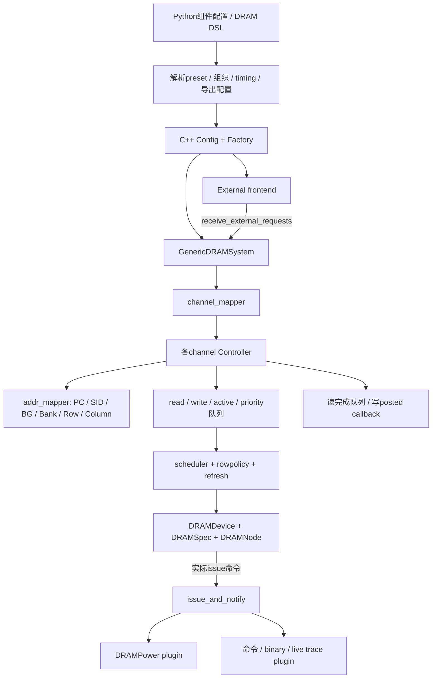
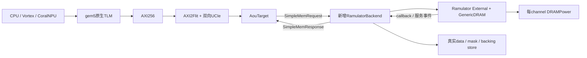

# Ramulator2 作为在线存储与功耗后端的源码评估

> 本文保存在线 Ramulator2 替代实施前的静态分析与方案；当前已实现代码、接口和运行配置见[在线后端说明](../ramulator-integration.md)。

分析对象是本工作区 `ramulator2/`，其 CMake 版本与 README 为 **Ramulator 2.1**，不能套用其他 Ramulator 2.0 分支的接口。本文区分现有实现和建议接入方案；未实施后端替换，也未构建或运行仿真。

## 1. 结论及适用层级

**可以作为联合仿真的 DRAM 控制器、DRAM 命令/周期时序和 DRAM 功耗计算核心，但当前目录还不是完整链路可直接选择的在线后端。**

要接入，需要新增请求适配，明确功能字节存储的所有权，并补齐写掩码处理、事务关联、时钟驱动、完成/可见性策略和独立验证。字节存储可以复用或新增 gem5 AbstractMemory backing，也可以由后端适配器维护，不要求两边各保存一份。现有 `memsim` 与 `ss_mem_*` 契约不能因名字或功能相似就被自动替换。

| 目标 | 当前实现 | 判断 |
|---|---|---|
| DRAM 行为级时序 | DRAMNode 状态、命令前置条件、各层 timing constraint | 支持周期/命令级建模 |
| 内存控制器 | 读写队列、调度、行策略、refresh、通道映射 | 支持研究排队、行命中和并行度 |
| 在线外部驱动 | External frontend、send/receive、tick、callback | 可以接受联合仿真的实时请求 |
| DRAM 能耗与平均功率 | 已集成进程内 DRAMPower plugin | 支持，准确性取决于 memspec 和活动率 |
| 真实读写字节、WSTRB | Request 没有 data/mask | 接入层须连接 gem5 backing 或实现后端 backing |
| 全链路完成反馈 | Ramulator callback 可作为完成依据之一 | 必须明确 posted write、合并写、forward 的语义 |
| DFI/pin 级波形、模拟 PHY | 当前核心没有对应完整接口模型 | 不能直接替代原后端的 DFI/PHY 证据 |
| 控制器逻辑、UCIe、CPU/GPU/NPU 功耗 | DRAMPower 不覆盖这些完整组件 | 整个系统功耗需要另外建模 |
| 当前工作区开箱即用 | 无 libramulator.so、无 Python 扩展、部分构建依赖未准备 | 仅能确认源码具备能力，尚未验证可运行性 |

行为级需要明确粒度：这里是数字化的控制器/DRAM 状态与时序行为，例如 ACT、PRE、RD、WR、REF 以及行缓冲状态，不是完整 DRAM RTL、DFI 电平仿真、存储单元电路或真实硬件的模拟电气模型。

## 2. 当前项目内部如何连接



### 2.1 配置、标准定义与生成

`python/ramulator/components.py` 管组件树，`dram/spec.py` 管 DRAM DSL，`dram/hbm3.py`、`hbm4.py`、`lpddr5.py`、`lpddr6.py` 定义标准。当前分发内置的是这四类，不能默认认为 DDR4/DDR5 等实现仍存在。

Python 配置解析组织、速率、时序和命令规则，`to_config()` 将符号转换为 C++ 可消费的具体值。`codegen.py` 生成标准 C++ 和 Python wrapper；C++ Factory 依据接口与实现注册创建组件，不在运行时重新解释 Python 的时序表达式。

纯 C++ 联合运行可加载预先导出的配置，运行过程中无需让 Python 驱动另一个仿真循环。关闭 Python bindings 的构建仍能包含 DRAMPower；但当前 preset 解析和配置导出流程通常需要先准备 Python 配置工具，或者提供已正确解析的配置。

### 2.2 请求接口

[`Request`](../../ramulator2/src/ramulator/base/request.h) 有：

- `addr`：字节地址；`intra_channel_addr`：剥去 channel interleave 位后的地址。
- `addr_vec`：DRAM 组织层次地址。
- `type_id`：Read=0、Write=1；内部维护命令使用不同约定。
- `source_id`、`ingress_id`：来源与外部入口标识。
- `size_bytes`：明确设置的请求大小。
- `command/final_command`：当前命令和完成该请求的终端命令。
- `arrive/depart`：控制器周期；`callback`：关联完成处理。

**没有真实 data buffer、byte-enable/mask、AXI ID、RP，也没有原系统的 child ID。** 接入层应以自有唯一 child token 捕获 callback 上下文，持有真实 data/mask，再重组上游 response。不能只用地址或可复用 AXI ID 做整次运行的唯一键。

[`ExternalFrontEnd`](../../ramulator2/src/ramulator/frontend/impl/external.cpp) 的 `receive_external_requests()` 创建 Request 后调用 memory system；`tick()` 不做事；`is_finished()` 始终 false。这是外部驱动的库接点，不适合在 gem5 中调用 `Simulation.run()` 等待自动退出。

还有一个直接影响多设备接入的限制：External 未覆盖 `get_num_cores()`，继承值为 1；ControllerBase 按该值创建 per-core 行命中统计数组，却以非 -1 的 source_id 直接下标访问。因此不能直接把 Host/GPU/NPU 的 0/1/2 当成现成 External 可安全消费的 source_id。初期可统一传 0、将真实来源保存在 backend 日志；要启用分源统计，需要先扩展 External 的来源数量，并在 controller setup 前配置好边界。

### 2.3 多通道与控制器

[`GenericDRAMSystem`](../../ramulator2/src/ramulator/memory_system/impl/generic_dram_system.cpp) 为每个 controller 分配 channel ID，维护统一 transaction size。send 校验 `0 < size_bytes <= get_tx_bytes()`，先 channel mapper，再 controller send；tick 推进所有 controller；统计聚合各通道性能和功耗。

`CacheLineInterleave` 用 transaction offset 和 interleave_bits 抽取 channel 位，再生成 intra-channel 地址；当前多通道数要求是 2 的幂。新的适配器不应先自己去掉 channel 位又让该 mapper 再剥一次。

[`ControllerBase`](../../ramulator2/src/ramulator/controller/controller_base.cpp) 持有 read/write/active/priority queues、完成读队列及缓冲写地址集合，组合 scheduler、refresh、rowpolicy、addr_mapper 和 plugins。队列满时 send 返回 false；这个结果应形成一直传回 AXI 和设备的反压。

`HBM34Controller` 支持 HBM3/4 的 row/column 命令总线和半 CK 边沿规则；LPDDR5/6 的控制器另有 split ACT、WCK/CAS 等规则。调度策略选择候选，DRAM device 决定当前候选是否满足时序，两者不能合并成一个固定 latency 数值。

### 2.4 DRAM 行为模型

[`DRAMDevice`](../../ramulator2/src/ramulator/dram/device.cpp) 的主要接口：

| 函数 | 行为 |
|---|---|
| `get_preq_command()` | 查询完成目标命令之前还需要发什么 |
| `check_timing()` | 检查组织树中各作用域的命令间隔 |
| `issue_command()` | 更新历史时序并执行 bank/row 状态动作 |
| `check_rowbuffer_hit()` | 判断访问与当前打开行的关系 |

`DRAMSpec` 保存组织、命令、时序和状态函数；`DRAMNode` 构建 channel/PC/SID/BG/bank 等层次树。访问关闭行通常 ACT→RD；访问错行通常 PRE→ACT→RD；每周期重新求下一合法命令，并受 nRCD、nRP、nRAS、nCCD、nFAW、refresh 等约束。

因此同为一个 32B 读，请求的等待时间会因行命中、bank 冲突、总线占用、读写切换与刷新而不同。这正是它相比定延迟 `SimpleBurstMemory` 的建模价值。

## 3. 功耗后端的真实实现与边界

### 3.1 在线统计路径

[`ControllerBase::issue_and_notify()`](../../ramulator2/src/ramulator/controller/controller_base.cpp) 先提交 DRAMDevice，再调用 rowpolicy 和每个 plugin 的 `on_issue()`。所以 DRAMPower 消费的是实际已发命令，不会把尝试但因 timing 被拒绝的命令也计入能耗。

[`DRAMPowerModel`](../../ramulator2/src/ramulator/controller/plugin/impl/drampower.cpp) 实现 `IControllerPlugin` 与 `IPowerReporter`：

1. init 读 memspec_path、strict_validation、include_interface 和活动率。
2. setup 创建 DRAMPower model，确定标准与时间单位，核对组织。
3. on_issue 转换命令、组织坐标和控制器时间戳。
4. power_stats 计算 core/interface/total energy 和平均功率。
5. finalize_power 幂等发送 END_OF_SIMULATION，结清统计。

一个 controller 最多一个 power reporter；多通道应给每通道独立 plugin/model。GenericDRAMSystem 将各通道能量求和，以统计 duration 计算平均功率。

### 3.2 可以获取哪些结果

`PowerStats` 包含 duration_seconds、core/interface/total_energy_j、average_power_w，细分 activation、precharge、read、write、refresh、RFM、background，以及 interface 两侧能量。系统层现有字段包括：

```text
dram_power_duration_seconds
dram_core_energy_j
dram_interface_energy_j
dram_total_energy_j
dram_average_power_w
```

平均功率是 `E / T`，不是瞬时功率波形。需要窗口功率时，可在统一仿真时间上采样累计 E，以相邻差值除以相邻时间间隔；不能将多次累计 E 相加当作总能量。

`controller_interface_energy_j` 指 DRAM 接口的控制器侧电气能量，不等于控制器数字逻辑、队列 SRAM、调度器和片内互连的全部功耗。CPU/GPU/NPU、AXI2Flit、UCIe 的功耗也不在这份 DRAM 统计内。

### 3.3 参数一致性和绝对准确性

[`HBM34PowerModel`](../../ramulator2/python/ramulator/power.py) 根据配对的 DRAM 对象生成组织与时序一致的 memspec，避免更换 HBM preset 后仍沿用旧功耗组织。strict validation 核对标准、PC/SID/BG/bank/row/column、width、burst 和 timestamp unit 等。

但**配置一致不代表绝对功耗已经校准**：

- 当前 HBM electrical/current 参数有估算、速率缩放和 HBM4 外推。
- HBM4 高于 8Gb/s 标记 `out_of_range_extrapolated`。
- 模型元数据明确 `absoluteAccuracyValidated=False`。
- LPDDR bundled fixtures 是探索用电流/阻抗配置，也不是厂商实测参数。

这些模型能输出可解释的建模能耗，适合对比调度、访存形状、行命中或配置变化；要用于具体产品的绝对瓦数预测，需要可核实的电流、电压、阻抗和器件测量校准。

### 3.4 数据活动与接口能量

Ramulator Request 无 data。LPDDR DQ 活动使用配置的 read/write toggle、duty rate，HBM 使用 memspec 的 datapattern。当前能量会随实际命令流变化，却不会自动跟随联合系统的真实 WDATA/RDATA 比特翻转变化。

若需要数据相关功耗，适配层应关联真实 DRAM 服务的数据与命令/时刻，并扩展功耗输入；不能只在外面统计一次 32B 的 Hamming distance 就假定已经模拟所有 lane、时隙、TSV 与内部数据总线。

HBM34PowerModel 当前把外部接口 `readEnergyPerBit/writeEnergyPerBit` 设为 0，理由是 IDD4 被视为含读写活动的总电流，避免重复计数。因此 `include_interface=True` 不保证 HBM interface energy 为非零，也不意味着已经覆盖 UCIe PHY。

LPDDR 命令映射还存在明确边界：ACT1/ACT2 对 core/interface 分别处理；CAS 同步命令审计到 ignored 计数；LPDDR6 long-burst `_L` 命令拒绝，不伪装成 short-burst 计能。

## 4. 联合仿真最关键的完成语义

### 4.1 读

普通读在终端 RD 发出后，以 `current_cycle + read_latency` 放入 pending，之后 tick 到期 callback。HBM4 read_latency 由 `nCL+nBL` 解析为内部 ticks。

若地址命中 buffered write，源码设 `depart=current_cycle+1`，不一定发新的 DRAM RD。Ramulator 不持真实写数据，外部 backing/write buffer 必须实现相同的可见性，否则可能在正确时间返回错误字节。

还需核对实际 callback 时间：forward 和普通读都向 m_pending 尾部插入，而 serve_completed_reads 只检查队首、未到期就停止。根据这两段路径推断，前面有远期普通读、后面新加入近期 forward 时，后者可能被队首阻塞，不能仅凭 depart=cycle+1 就宣称 callback 必然下一周期发生。这个组合应做定向回归，并明确使用 FIFO 完成策略，或调整为按到期时间管理完成；不能把源码的“队列已按 depart 排序”注释当作已经验证的事实。

### 4.2 写

当前实现有两个不同路径：

- 普通写在终端 WR/WRA 服务路径退休时调用 callback；`write_latency` 仅用于计算 latency 统计，不让 callback 延迟到数据 burst 结束。
- 缓冲中相同地址的写可 coalesce，新写的 callback 在 send 内同步触发，不占新槽，也不发独立 WR。

因此 callback 不总等价于物理 DRAM 服务完成，写 Request.depart 也不能假定已经填成有效完成周期。

posted write 是一种合法控制器策略，AXI B 也不天然要求等待存储单元最后物理动作；问题在于当前系统想测量和验收的是哪种完成契约。

| 契约 | B/上游 completion 的含义 | 必须配套的行为 |
|---|---|---|
| posted | 控制器可靠接收/合并该写，后续继续排队服务 | 写缓冲保存真实数据，正确 forward，同址排序，退出时 drain 物理服务 |
| modeled DRAM service | 对应写数据 burst 达到所定义的完成时间 | 明确 issue tick 与 nCWL/nBL，延迟 completion，处理合并写从属关系 |

选择第二种时，应增加明确的服务完成通知，或在关闭/规避 coalesce 的受控模式中依据实际终端 issue 生成 future completion。不能给所有 callback 简单加一个固定延迟：合并写可能根本没有新的 WR，LPDDR 长短 burst 也不能混用。

`nWR` 是写恢复和后续 PRE 等时序约束，不应未经定义机械加到每个上游 B 的等待中；应区分数据 burst 完成与后续命令合法时间。

### 4.3 与原验收的差异

当前 `check_memsim.py` 定向验收要求每个 native child 能关联到物理 RD/WR、DFI payload 和 completion。Ramulator 的 forward/coalesce 是多对少映射，不能原样满足“一 child 一 RD/WR”的假定。

建议初期使用保守模式：同一个 DRAM transaction granule 的读写冲突按接收顺序服务，其他不重叠 granule 可并发，以建立真实字节与物理服务的清晰对应。明确这个模式会改变控制器可观察的重排/forward/coalesce 机会，不能当作原生控制器全部性能行为。

之后再实现真实写缓冲与合并/forward，验收记录增加 cause=`dram/forward/coalesced`、parent/child/physical-service 关联。独立 checker 按该语义检查数据、时序和命令映射，而不是强求每个合并请求重复计一次 DRAM 能量。

## 5. 适合本系统的接入位置

建议在现有 AoUTarget 后面新增 **RamulatorBackend**，保持完整目标访存路径：



其中新增 backend 和 backing store 是建议设计，当前未实现。

### 5.1 推荐的职责拆分

| 层 | 所有权与责任 |
|---|---|
| AouTarget | RP、线上 ID、整 AXI burst 重组、消息 credit 与响应封包 |
| RamulatorBackend | 上游 burst、唯一 child token、真实 data/mask、功能存储、冲突顺序、response 反压 |
| Ramulator | channel/bank 地址映射、控制器调度、DRAM 状态和命令时序 |
| DRAMPower | 从同一已发命令流与一致时间单位计算 DRAM 能耗 |

原来的 `SimpleMemRequest/Response` 已经携带整 burst 和 32B lane，可复用其 seam。不要把新的 backend 插到 SystemXBar 下直接返回 Packet，否则完整用例会绕开 TLM/AXI2Flit/UCIe。

### 5.2 原生 gem5 wrapper 能复用什么

[`resources/gem5_wrappers/ramulator2_base.cc`](../../ramulator2/resources/gem5_wrappers/ramulator2_base.cc) 是另一方案：gem5 AbstractMemory 持有功能 bytes，Ramulator 提供时序；它示范 Factory 初始化、tick、retry、drain 和 stats/finalize。

但当前 wrapper 的写请求在 Ramulator 接受后就 `accessAndRespond(pkt)`；写 callback 用于 outstanding/drain，不用来延迟该写的 Packet response。读在 callback 后 accessAndRespond；原子访问还是任意固定延迟。它不能直接当作“每个写响应等 DRAM 服务结束”的证据。

它的 read 关联使用 address→Packet FIFO，多端口、同址乱序、forward 等组合需要核对 FIFO 假定；send 可能同步 callback，计数与上下文必须在调用前可用，避免生命周期和 drain 判定出错。新的后端应使用独立 token，且将完成先放本地 pending completion 队列，避免在 send 调用栈重入上层 response。

SConscript 还硬编码 `/workspaces/ramulator2`，当前 wrapper 不在根 env 构建的 EXTRAS 接线里。它适合参考，不是当前工作区已接好的完整链路。

## 6. 接入层需要补齐的具体接口

### 6.1 请求与真实数据

对每笔 SimpleMemRequest：

1. 按现有 AXI contract 核对 SIZE/LEN、对齐、4KiB、lane、lock、有效地址与写拍数。
2. 以 `physical_address - backend_base` 得到后端相对地址，保存原物理地址供观察和 response 重组。
3. 逐 beat 抽有效 lane，保留每字节 WSTRB，不将部分写变成无掩码覆盖。
4. 查询 get_tx_bytes，按 transaction 边界拆 child；不仅限制 size<=tx_bytes，还要保证没有 child 跨 granule。
5. 为每 child 分配唯一 token；保存 burst/rp/id、offset、有效字节和功能存储关联。
6. false 拒绝时保持原请求，不更新已接受计数或提交真实写；之后在统一时钟重试。
7. 完成后组读拍或写状态，上游 response FIFO 满时保持数据和槽位。

默认 HBM4 transaction 为 32B，与 AXI256 full beat 恰好同大小，但 4B/16B 的窄读写仍需建模为实际 DRAM burst 的时序与能量，功能层仅返回或更新有效字节。WSTRB=0 的字节不变；部分写不应自动制造一个上游可见读请求。若选定真实控制器策略需要额外 RMW，应显式记录其内部读和能量。

如果要研究非对齐窄访问的物理事务，应使用对齐 transaction 基址加有效 byte offset 的设计，或者严格说明以请求原地址映射的策略；不能让同一物理 granule 因不同 byte 地址被误当成互不冲突。

真实 backing store 可用按需分配的稀疏页，避免为完整 BAR 范围一次性分配数 GiB。它属于新后端的数据实现；应与 DRAM/写缓冲完成策略一致，不提供提前绕过响应的数据旁路。

### 6.2 时钟与生命周期

Ramulator 是普通 C++ 库，可以由 gem5 event 或 gem5 原生 SystemC thread 调 `memory_system->tick()`，不需要再链接一套 SystemC，也不需要另开模拟器进程。

全局仍为 1fs。内部周期应从**解析后的配置**获得：HBM3/4 `tick_multiplier=2`，导出阶段已将 CK 转为 half-CK ticks，C++ tCK_ps 对应内部 tick，不能再除以 2。

建议只做一次确定的 ps→fs 转换，再逐周期推进；优先取已解析整数 ps，避免长期用 float ns 累计误差。原 Python resolve 对半周期采用整数 ps 量化，1fs 全局时间不会自动消除该上游量化。

无请求时也要推进 refresh 与背景状态；若停止 tick，须有等价 idle/refresh 快进算法。本次未见可直接作为系统级统一 drain 的公开 IMemorySystem 接口，不能仅等待上游 write callback 数量归零就认定全部物理服务结清。

尤其 posted/coalesced 写可能尚在服务队列，结束时应检查控制器 pending/queue/active 状态、适配层 response queues 和所定义的未来写完成。refresh 是周期性维护，drain 条件应区分工作请求与维护，不能要求自动刷新以后永远不再发生。

改变外部 scale 也要统一 DRAMPower 的物理时间口径：如果 gem5 将周期放大四倍，而 power model 仍用原 tCK 计算 T，就会让功率和时间不一致。应重新生成配对 timing/memspec，或明确一个经校核的联合时间映射，不能只改调度 wait。

### 6.3 构建与配置

| 文件/入口 | 必须联动的内容 |
|---|---|
| `gem5_axi/ramulator_backend.hh/.cc`（建议新增） | FIFO seam、真实数据、child、时钟、完成、统计 |
| `gem5_axi/aou_backend.cc` | 新 backend 构造/bind/finish 分支 |
| `Gem5Axi.py`、run.py、run_xpu.py | 显式 `memory_backend=ramulator2` 和配置文件/参数 |
| `gem5_axi/SConscript` | 新 source、include、libramulator、RPATH，明确旧 memsim 是否启用 |
| `env/build.sh`、build_xpu.sh | 纯 C++ CMake 构建、DRAMPower、可选后端源检查 |
| `env/check_sources.py`及依赖说明 | 后端专属必需源码，避免默认无条件要求缺失mem_sim |
| bootstrap/依赖包 | yaml-cpp、fmt、DRAMPower/DRAMUtils固定依赖与缓存 |
| run/verify/check/view | backend-specific证据与联合反馈用例 |

纯 C++ 可用 `RAMULATOR_PYTHON_BINDINGS=OFF`；功耗需要 `RAMULATOR_ENABLE_DRAMPOWER=ON`。C++20 库与 gem5 的编译器/libstdc++ ABI 要匹配，或者以系统内 C ABI 包装隔离复杂类型。CMake 会准备第三方依赖，SS_OFFLINE 的 bootstrap 限制不等于此构建自动离线。

也可新增一个实现旧 `ss_mem_*` 风格的适配库，复用部分桥代码，但缺少原 online.h 使 ABI 不能凭空重建，且 DRAM/DFI 输出语义仍不同。因此更清晰的是显式新增后端选项，保留原 memsim 路径，不伪装成已恢复的 mem_sim。

## 7. 联合仿真如何验收

建议分四阶段，每阶段独立结果目录，完整运行仍使用 `--listener-mode=off`。

1. **Ramulator + DRAMPower 单独验证**：标准/device timing、controller scheduling、refresh、功耗 plugin consistency/strict mismatch，确认实际命令计数及单位。
2. **新 backend 定向验证**：读写真实 bytes、partial mask、窄 lane、跨granule、错误地址、队列满重试、同址冲突、callback同步和乱序、response hold、完整drain。
3. **完整 AXI→AoU→UCIe 验证**：保留五通道VCD和两端时间戳完整Flit；原AXI/AoU/raw-link checker继续使用，新后端checker关联burst→child→真实service/forward/coalesce→response，独立byte scoreboard。
4. **CPU/GPU/NPU 反馈验证**：保持计算输入和结果一致，改变 DRAM timing 或受控队列配置，核对目标 roundtrip、Host退出、GPU/NPU周期确实改变；polling访问数允许随反馈变化。

新增观察建议为 ramulator_bridge.csv、ramulator_commands.csv、backend_data_events.csv、ramulator_stats.yaml、dram_power.json；这些名称是方案，不是已经存在的输出。

命令日志要保留实际 service tick、组织坐标和 cause/关联 token。BinTraceRecorder 可作为命令证据基础，但不自带完整 data/mask。当前无 DFI 模型，因此不能生成一个挂名 DFI CSV 冒充真实 DFI 信号；现有 memsim DFI checker须由等价、明确粒度的 backend-specific检查替代。

功耗核对包括：各通道能量汇总、E/T单位、同一命令不重复计数、无业务时背景/refresh、ROI snapshot/reset/finalize的一致性。HBM interface能量为0时应按当前模型定义判断，不能以“必须非零”替代模型语义。

## 8. 当前证据和建议

本次阅读确认了 External、GenericDRAM、ControllerBase/HBM34、DRAMDevice/Spec、DRAMPower plugin、power.py、HBM4 example、gem5 wrapper和相关测试的实现。测试文件存在，但本次没有执行；当前没有已编译libramulator.so/Python扩展，yaml-cpp/fmt等缓存也未准备。

本系统原在线mem_sim缺失，Vortex外部树未初始化，完整XPU验收仍需补齐其自身锁定依赖；新增Ramulator后端可以解除该新分支对mem_sim的依赖，但不自动补齐Vortex。

推荐路线是先以HBM4为目标、用既有SimpleMemRequest seam实现真实数据与保守冲突顺序，再验证完整CPU链路与DRAMPower，随后扩展GPU/NPU和写缓冲/forward/coalesce。选择这条路线能够保留完整链路的协议与错误重放研究，同时增加周期级DRAM和可追溯功耗统计。

最终可以实现的是“设备执行、片间链路、DRAM服务延迟与DRAM能耗处于同一时间线”的联合仿真。功耗目前是命令流驱动的在线统计；若希望温度/电压/功耗限额反过来改变时序，还需要热、电压或节流反馈模型，现有plugin不会自动形成这种反馈。

## 9. 补充：gem5 已有真实数据，是否还需后端再存一份

**不需要重复存储。** 真正要求是目标地址有唯一明确的功能数据源，而且数据可见性、返回路径与所选择的 DRAM 完成契约一致。功能数据所有权与时序模型所有权可以分开。

gem5 中应区分三种数据：

| 对象 | 保存的是什么 | 能否作为完整目标内存的数据源 |
|---|---|---|
| Packet / TLM payload | 某次事务的写数据，或等待填充的读buffer | 单次传输buffer，不自动成为持久内存 |
| Cache | 按cache协议保留的部分line | 不是完整物理内存；当前目标映射uncached |
| AbstractMemory/SimpleMemory backing | 对其负责地址区间的持久功能字节 | 可以，但必须为目标区间建立或连接 |

当前 run_xpu.py 的 host_mem 只负责host_heap；shared_buffer、npu_work和GPU BAR路由到TLM/AXI链路。Master读数据在R握手时从真实RDATA填回payload，原生bridge的payload data pointer指向Packet buffer。这些目标地址没有因为“gem5存在本地主存”就自动在host_mem中拥有副本。

一种可行的新设计是：由gem5 AbstractMemory或系统内统一BackingStore保存目标字节，AouTarget后面的RamulatorBackend在DRAM服务对应的事件读取/修改这份backing，再生成B/R response。Ramulator只处理请求时序，DRAMPower只处理命令/活动能耗。gem5 backing可以位于进程内的共享数据对象，不必作为第二个同地址的XBar responder，以免绕开完整链路或出现range重复。

这正是现有gem5 wrapper分离功能与时序的思路，但完整链路需要将backing访问放到其内存服务接缝，并按照既定语义让真实RDATA经过reverse UCIe和AXI回到Packet。若仅在上游填正确Packet而线上RDATA是占位数据，只能验证时序，无法完成当前端到端数据链路验收。

### 9.1 功耗与字节放在哪里无关

命令/状态级功耗由Ramulator实际issue命令和bank状态驻留时间驱动，并结合器件电压、电流等参数计算。即使功能字节由gem5保管，DRAMPower仍可照常统计ACT/PRE/RD/WR/REF与background。不能统计宿主机保存这些字节的RAM耗电并把它当成模拟DRAM功耗。

数据相关功耗则需要额外观察实际服务的数据活动。存储位置不会自动改变现有plugin：当前Command构造没有传data，HBM34的doInterfaceCommandImpl还是空实现，HBM core使用memspec里固定dqRate/tsvRate/bgRate。

| 功耗口径 | 输入证据 | 当前接入需要 |
|---|---|---|
| 命令/状态级 | 已发命令、组织、时间戳、状态、memspec | 配置现有DRAMPower plugin |
| 固定活动率估计 | 上述输入+toggle/duty/datapattern | 现有配置已支持相应标准口径 |
| 真实数据活动 | 上述输入+实际DRAM读写数据、传输次序/时刻、mask与接口映射 | 从唯一backing和服务buffer取数，扩展对应功耗接口/模型 |

接口翻转可概念性统计为popcount(previous_bus_value XOR current_bus_value)，但必须在同一物理总线、正确传输顺序和lane映射上统计。它不是popcount(old_memory_value XOR new_memory_value)：前者是总线相邻传输，后者是同一存储地址内容变化。更精细模型还区分0→1、1→0、ones/zeros、终端电阻、闲置状态及编码。

WSTRB负责哪些存储字节更新，并不保证未使能lane在线上完全不活动。窄访问的有效byte数也不等于实际DRAM burst的总传输bit数；不应将DRAM读写能量按WSTRB数量简单线性折算。

累计能量通常按模型边界汇总E_core+E_interface，平均功率为E/T。如果通过真实活动更新模型，须替换或校正原活动估计，避免在已经含读写动态活动的IDD4能量上再无条件叠加一份比特能量。UCIe PHY属于另外的接口，必须单独定义功耗边界。
