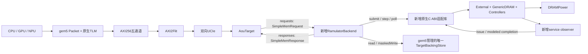

# Ramulator2 在线联合仿真的端口与实施方案

> 本文保存在线 Ramulator2 替代实施前的静态分析与方案；当前已实现代码、接口和运行配置见[在线后端说明](../ramulator-integration.md)。

本方案针对当前工作区的实际源码。以下新增类、接口、参数、命令和产物均为设计，尚未实施；现有接口单独标明。目标是跑通 CPU/GPU/NPU → 原生 TLM → AXI256 → AXI2Flit → 双向 UCIe → Ramulator，并使真实数据和服务完成沿原路返回，同时统计 DRAM 能耗。

## 1. 端口选择

**复用 AouTarget 的整 burst 请求/响应 FIFO，新增 SystemC RamulatorBackend；其内侧通过无 SystemC 依赖的原生适配库驱动 Ramulator。** 不增加第二条 CPU 直达内存的数据通路。



前端现有 Packet/TLM 端口、AXI 五通道、FDI 四个 FIFO 均继续使用。新增端口位于存储侧：

| 边界 | 端口类型 | 本方案语义 |
|---|---|---|
| AouTarget→RamulatorBackend | `sc_fifo<SimpleMemRequest>` | 完整 AXI burst，已收齐写数据 |
| RamulatorBackend→AouTarget | `sc_fifo<SimpleMemResponse>` | 完整 burst 服务完成和真实读数据 |
| RamulatorBackend→原生库 | C ABI `try_submit/step/poll_event` | 一个物理 DRAM transaction；无数据副本 |
| RamulatorBackend→backing | 进程内 `read/maskedWrite` | 唯一目标功能字节；访问不独立产生 timing response |
| Controller→DRAMPower | 已有 `on_issue(Request)` | 实际已发命令驱动功耗 |

当前外侧接口真源为 [`simple_mem_if.h`](../../axi2flit/systemc/include/simple_mem_if.h)，接线为 [`aou_backend.cc`](../../gem5_axi/aou_backend.cc)。

## 2. 外侧端口：完全复用现有契约

### 2.1 请求

现有 SimpleMemRequest 字段：

| 字段 | 意义 | 新后端处理 |
|---|---|---|
| `write` | 读/写 | 转 native Read=0 / Write=1 |
| `rp` | 资源平面 | 原值保留，不当作设备来源 |
| `address.id` | 线上 ID | 留在 burst 上下文，不作为全局唯一 token |
| `address.addr` | 64bit 物理地址 | 校验后转后端相对地址 |
| `address.len/size/burst` | 拍数、有效拍宽、突发形式 | 校验并拆 transaction |
| `address.user/lock/...` | AXI 属性 | 保留返回USER；初期拒绝独占等未支持属性 |
| `write_beats[].data[32]` | 完整 AXI256 lane | 抽有效 lane，保存真实值 |
| `write_beats[].strobe[32]` | 非零表示该字节更新 | 严格作为 byte-enable，不能反向解释 |

初期不改线上 AoU 格式，不把 gem5 requestor/stream 自动塞进 RP 或 USER。当前请求接口也没有完整设备source元数据；来源可由既有TLM/Packet日志交叉关联，若要在线传递新增元数据须另行明确线上协议。

### 2.2 响应

现有 SimpleMemResponse 字段为 write、rp、id、resp、user、read_beats。

- 写 response：read_beats 为空，BRESP 表示该 burst 按本方案的服务口径完成。
- 读 response：恰好 LEN+1 项；每项有32B data、RRESP、USER。有效字节恢复原AXI lane，无效lane初始化为0。
- RLAST 不需要新增字段，AouTarget 根据响应拍数生成。
- 至少保持同方向、同RP、同ID顺序。初期用全局parent FIFO响应，比最低契约更强。
- response FIFO 满时不释放parent槽，不丢数据，不再把该完成重复提交。

当前 AouTarget 的 collect 按 `(write,rp,id)` 匹配最早 ticket，并检查拍数，能够直接接收上述 response。

### 2.3 接线示意

以下是新增代码的结构示意，省略参数、错误检查和编译条件：

```cpp
sc_core::sc_fifo<SimpleMemRequest> requests{"requests", 4};
sc_core::sc_fifo<SimpleMemResponse> responses{"responses", 4};

target.mem_req(requests);
target.mem_rsp(responses);

ramulator->request(requests);
ramulator->response(responses);
// ramulator还持有唯一backing、native library handle和内存周期。
```

```cpp
class RamulatorBackend : public sc_core::sc_module {
public:
    sc_core::sc_fifo_in<SimpleMemRequest> request{"request"};
    sc_core::sc_fifo_out<SimpleMemResponse> response{"response"};
    bool idle() const;  // 包括parent、children、未消费完成和待返回数据
    void finish();     // 仅已drain时finalize，不能在finish中私自跑第二个模拟循环
};
```

无需将内存时钟直接绑定AXI的clk。后端自身按DRAM内部tick运行，FIFO使两个时钟域在同一gem5事件时间线上交互。

## 3. 内侧端口：原生适配库

### 3.1 为什么采用独立C ABI

Ramulator使用C++20，其header、Factory、std::function和plugin无需暴露给gem5的编译单元。建议在主仓库普通目录 `ramulator2/integration/` 新增C++适配，输出 `libss_ramulator_backend.so`，只导出C ABI；gem5侧dlopen/dlsym加载。

这与当前NPU/GPU opaque handle接缝一致。它仍是同一进程、同一宿主线程调用的普通库，没有第二套SystemC或跨进程锁步。C ABI还提供版本查询，提前拒绝不匹配库。

也能直接调用Ramulator C++接口，但本方案固定选择C ABI，避免在两套构建系统之间泄漏复杂类型。

### 3.2 最小接口草案

```c
#include <stdint.h>
typedef struct ssr_handle ssr_handle;
typedef struct ssr_options ssr_options;
typedef struct ssr_info ssr_info;

typedef struct {
    uint64_t token;           /* 0保留给无业务归属的maintenance */
    uint64_t address;         /* 后端相对、transaction对齐的字节地址 */
    uint32_t bytes;           /* 初期等于get_tx_bytes，HBM4默认32 */
    uint32_t operation;       /* 0=read, 1=write */
    uint32_t source_id;       /* 初期固定0 */
} ssr_request;

typedef struct {
    uint32_t kind;            /* ISSUE / SERVICE_COMPLETE */
    uint32_t operation;
    uint64_t token;
    uint64_t cycle;           /* Ramulator内部tick */
    uint64_t issue_cycle;     /* 终端RD/WR的issue tick；非终端按定义记录 */
    int32_t command;          /* 命令ID；名称/标准从配置字典解析 */
    int32_t channel;
    uint32_t level_count;
    int32_t coordinate[8];    /* 初期HBM4最多8层；超限拒绝配置 */
    uint32_t status;
} ssr_event;

int ssr_create(const ssr_options*, ssr_handle**);
int ssr_get_info(ssr_handle*, ssr_info*);
int ssr_try_submit(ssr_handle*, const ssr_request*);
int ssr_step(ssr_handle*);
int ssr_poll_event(ssr_handle*, ssr_event*);
int ssr_is_idle(ssr_handle*);
int ssr_finish(ssr_handle*, const char* output_directory);
void ssr_destroy(ssr_handle*);
```

options包含ABI版本、解析后的config路径、最大active child和event容量；info包含ABI版本、内部tick_fs、transaction_bytes、channel数与可映射容量。正式实现给结构增加struct_size/version和明确的保留字段，避免二进制布局随修改漂移。

约定 try_submit 返回1接受、0反压、负值错误；poll_event返回1有事件、0无事件、负值错误；step一次且只一次推进一个内部tick。所有C++异常在C ABI边界捕获，通过错误查询返回，不穿越动态库接口。

这个接口**不传真实data/mask**：真实值只在唯一backing与桥的有界transaction buffer中。native request负责物理时序，ISSUE负责命令证据，SERVICE_COMPLETE负责数据服务时刻。需要真实数据功耗时再增加明确的activity输入接口，不能把保存buffer等同于已经支持比特功耗。

### 3.3 实际调用Ramulator

create时Config::parse_config_file → Factory::create_frontend/create_memory_system → 两端connect。frontend必须是External，不是SimpleO3/trace。

try_submit内部调用External::receive_external_requests，并明确设置size_bytes。当前External默认num_cores=1，所以source_id固定0；backend保留wire ID/RP用于关联。扩展真正分源统计时，先增加External的source_count/get_num_cores，再允许0/1/2等值。

当前公共接口尚未直接提供整数tick、组织容量和全部需求队列idle查询。observer可在setup时收集每channel的ControllerBase/DRAMSpec，读取解析后的tick和组织；还需给ControllerBase增加只读的pending-demand查询，覆盖read/write/active/pending与所需priority需求。不能假定库已有这些查询，也不能从外部非法访问protected队列。各channel初期必须同标准、同内部周期和transaction大小，否则拒绝配置。

step调用memory_system->tick；不调用Simulation.run。finish结清功耗、统计和观察流，destroy释放对象。保持create→connect→tick→drain→finalize→destroy顺序，完成后禁止继续issue。

## 4. 明确服务完成事件，不能原样套用写callback

### 4.1 第一版采用的统一口径

**读完成：读数据burst建模完成；写完成：写数据burst建模完成。** 一笔AXI burst所有children完成后，才允许生成整burst response。

这不是AXI唯一合法写响应策略，而是为本系统延迟反馈与跨层验收选择的一致口径。

当前普通读callback等到RD后的read_latency；普通写callback在终端命令退休路径触发，write_latency只用于统计；coalesce还可能在submit时同步callback。因此现有写callback只作native请求生命周期证据，不直接触发上游B。

### 4.2 最小Ramulator源码适配

1. 在Request新增默认0的 `uint64_t integration_token`，不改变标准请求类型、调度和时序。External增加一个能传该token的嵌入入口，原入口仍可用。
2. 新增只观察的SystemBridgeObserver plugin，通过已有on_issue接收实际已发命令。DRAMPower照常作为另一个plugin存在。
3. observer按token记录每条已发命令；维护命令保留token=0，但仍送DRAMPower、仍进入命令日志。
4. 终端RD issue tick=C，排读完成到 `C + resolved_read_latency`。
5. 终端WR issue tick=C，排写完成到 `C + resolved_write_latency`。HBM4来自 `nCWL+nBL`；不机械再加nWR。
6. native适配层在tick到期时发SERVICE_COMPLETE；每token恰好一次。write callback提前退休时，future completion仍保留，该token仍计为在服务中。

observer的event sink绑定到本次opaque handle。可由native create在配置树为每channel注入observer与instance ID，并在setup解析到其上下文；destroy时解绑。不能用一个全局裸指针接收所有实例的事件。observer必须与DRAMPower一起创建，并共享控制器实际issue路径。

初期限定HBM4和常规RD/WR。RDA/WRA或其他标准加入时，需按DRAMSpec的终端命令表和实际长短burst定义适配，不能仅字符串匹配RD/WR就宣称所有扩展完成。

### 4.3 第一版主动规避forward/coalesce歧义

后端按物理transaction granule建立hazard FIFO，排序键为parent接收序号与child序号。同一granule至多一个native child在服务，完成并完成backing操作后才解锁后继。

在**parent接受时**给全部child描述符预留hazard顺序，不能只在child实际submit时登记，否则较早长burst的未提交child可能被较晚请求超越。

这样同址读写、重复写不会同时进入native write buffer，初期不走external forward/coalesce，可建立child与实际RD/WR的一对一对应。不同granule继续并发，native仍能体现行命中、bank冲突、刷新与调度。

这是保守接入模式，会抑制原生控制器部分重排和写缓冲收益，性能结果应标明。第二版才实现真实write buffer与forward/coalesced依赖组，扩展完成cause和多对少命令关联。

native读callback可与新service event作一致性对照；新service events按due tick管理，不依赖现有混合forward/ordinary读FIFO的隐含排序假定。

## 5. 唯一功能数据源

### 5.1 推荐实现为gem5管理的目标BackingStore

新增 `TargetBackingStore` SimObject或等价系统内共享数据对象，使用64bit物理地址和按需4KiB页；默认未写字节读0，支持maskedWrite。它不是Ramulator内部第二份RAM。

```cpp
void read(uint64_t physical, uint8_t* destination, size_t bytes);
void maskedWrite(uint64_t physical, const uint8_t* source,
                 const uint8_t* byte_enable, size_t bytes);
```

AxiDemo参数引用该对象，RamulatorBackend持其引用；普通程序/栈仍使用已有host_mem。当前host_mem没有保存目标共享/BAR全部字节，不能直接复用其不相交地址区间。

BackingStore不另向SystemXBar宣告相同目标range，也不加入SE普通页池，不独立返回Packet。CPU、GPU、NPU只通过完整主链路到达它，避免重叠responder或functional旁路。

### 5.2 data服务时刻

- 接受写：保存本次数据/mask，不提前更新持久backing。
- 写SERVICE_COMPLETE：按mask更新backing，记录真实写事件，解锁granule。
- 读SERVICE_COMPLETE：快照该granule对应的真实字节，保存到parent返回buffer，再解锁granule。
- response等待FIFO或链路credit时，读快照保持不变；后续写不能改变已经服务完成的读结果。
- 所有子请求完成后组response，不能用占位RDATA后在Packet层补正确值。

这里只保存一份持久内存；parent/child buffer是传输和在途快照，会在生命周期结束时释放，不是第二份完整目标RAM。

## 6. 从AXI256 burst拆成物理DRAM transaction

初期HBM4默认transaction=32B，但以ssr_get_info实际值为准。后端初始化核对transaction、窗口对齐、范围和容量。

```text
beat_bytes   = 1 << SIZE
burst_bytes  = (LEN + 1) * beat_bytes
beat_addr    = AXADDR + beat_index * beat_bytes
axi_lane     = beat_addr % 32
relative     = physical - backend_base
tx_base      = floor(relative / transaction_bytes) * transaction_bytes
tx_offset    = relative - tx_base
```

连续有效字节按transaction边界分组，一组一个child。native提交对齐tx_base、size=transaction_bytes；功能层只读回或更新请求有效字节。mask保存为transaction粒度的数组，其他byte_enable=0。

| 上游访问 | 初期HBM4物理children | 功能处理 |
|---|---|---|
| 地址尾数0x14写4B | 一个32B transaction | offset20..23，按原mask更新 |
| 尾数0x10读16B | 一个32B transaction | 返回offset16..31，恢复AXI lane16..31 |
| 尾数0x10读两个16B beat | 两个32B transaction | 第一组后16B、第二组前16B |
| 对齐32B × 256拍 | 256个transaction描述符 | 分批提交，不能要求一次容纳全部 |

WSTRB全0初期仍按既定物理写服务建模，数据不变；未来write suppression要显式改变命令与能量口径。部分写初期不额外产生RMW读；如果特定控制器需要内部RMW，应另建内部事务和功耗证据。

完整burst在执行前校验所有地址和lane。越界DECERR=3，未支持独占/非法lane按约定SLVERR=2；结构非法依现有contract报错。错误burst不执行部分真实写，读error response仍保持原拍数。

64bit贯穿物理地址、相对地址、token和长度计算，检查溢出以及Ramulator int64 Addr_t上限。启动时校验backing窗口不超过所选DRAM组织/mapper可寻址容量，否则不同高地址可能截位映射到同一DRAM位置，功能数据看似正确但时序错误。

## 7. 有界队列与反压

第一版建议值如下，均为设计参数，不是已测最优配置：

| 资源 | 值 | 理由 |
|---|---:|---|
| 外侧request FIFO | 4 | 复用当前Fabric |
| 外侧response FIFO | 4 | 复用当前Fabric |
| backend parent slots | 8 | 与当前AouTarget outstanding上限相适应 |
| native active child上限 | 32 | 在途物理事务有界 |
| HBM controller read/write queue | 各8/通道 | 初期易制造并验证反压，可调 |
| 第一轮CPU/NPU channel数 | 2 | 配置简单且满足interleave的2次幂要求 |
| GPU/三源channel数 | 8 | 对本方案preset覆盖大目标窗口，见下文容量核对 |
| child提交率 | 每DRAM tick最多1笔 | 与现有桥类似；后续再放开吞吐限制 |

parent只存有界的child描述符，active child分批提交，长burst不会因为child数大于32而无法服务。event queue按每tick最大issue数和active child完成数预留容量，poll每tick抽干；不足时显式拒绝配置或报错，不静默丢观察/完成事件。

反压路径：上游不消费response → parent槽不释放 → backend停止读取request FIFO → FIFO满 → AouTarget停止submit并保持outstanding → AoU credit/队列逐步受限 → AXIREADY受限 → TLM槽受限 → 设备等待。

不因response被阻塞就停止DRAM tick，已接受children仍需完成，refresh/background也继续计时。parent已有空间保存它们，不能建立无界completion缓存。

## 8. 统一时间与每tick处理顺序

全局仍为1fs。内部period_fs从解析后的HBM配置获得，HBM half-CK已经在to_config转换过，不再除2。库info最好从解析整数ps返回 `tick_fs=ps*1000`，避免用float ns反复累计。

native从仿真t=0开始推进，包括链路训练期间；初始cycle=0，第一次tick发生在period_fs。这样没有隐藏start offset。若以后从其他时刻启动，必须显式记录start_tick并使用 `absolute_tick=start_tick+cycle*period_fs`。

每个DRAM tick固定按以下顺序：

1. 等到下一period，调用ssr_step，内部clock加1。
2. poll抽干ISSUE/SERVICE_COMPLETE；核对tick映射、token、无重复完成。
3. 对完成child执行真实backing读/写，保存读快照，解锁hazard并累计parent完成。
4. 尝试发送队首已完成parent response；FIFO满则保留。
5. 若parent有槽，读取至多一笔外侧请求，校验并创建描述符/hazard顺序。
6. 尝试提交至多一个eligible child；native返回0则保持token和buffer重试。

此顺序明确：在tick N接受的新child，最早tick N+1 issue，形成一个可解释的DRAM入口周期。不要在checker里假定同tick接受即可同tickissue。

调用submit之前先建立可被观察/回调引用的上下文，拒绝后回滚accepted状态。即使初期避免coalesce，C ABI仍不得依赖“callback必定在submit返回以后发生”。

scale参数初期不提供任意wait倍乘；快慢对照用两份解析DRAM配置和匹配功耗memspec。需要scale时必须同步功耗time unit与统计duration，否则gem5时间与E/T分母会不一致。

## 9. 功耗接入

每channel一个现有DRAMPower plugin；SystemBridgeObserver只取证，不安排DRAM命令，不额外计能。HBM34PowerModel用同一DRAM组织/timing生成memspec，strict_validation=True。

第一版输出命令/状态级能量和当前datapattern估计，至少输出duration、core/interface/total energy、average power、分项、mapped/unsupported计数和modelMetadata。

需要窗口功率时取累计能量差除以时间差；finalize幂等。HBM当前interface项可能按模型定义为0，不能强制非零。控制器逻辑和UCIe的功耗另有边界，不混入DRAM统计。

真实data由backend服务buffer与backing提供，后续活动接口必须按实际物理传输顺序关联token/command/time，替换原活动估计；当前HBM接口空实现不会因保存data自动变成逐比特功耗。

## 10. 完成、drain与停止

需求流停止之后要等待：parent与active child、hazard需求描述符、future服务完成、native需求队列、request/response FIFO以及必要的target/link/Master状态结清。目标data已完成但尚未返回也算在途。

ssr_is_idle包括posted write的future data完成，不能只检查原生callback或request已从write queue删掉。bank保持打开不表示还有未完成业务，自动refresh也不要求以后永不产生；idle查询应区分业务与维护。

配置完成条件时可以增加一个gem5可调用的drained()导出，运行脚本在仿真事件队列上用有限tick窗口继续等待drain。finish只验证与结清，不能在finish里循环调用native tick而让gem5时钟停止。

现有AouBackend::finish只有分支摘要，新增后端需要统一completed/errors/drained查询，不能让三分支代码误解引用空simple指针。完整链路drain可先沿当前定向用例退出时已退休事务的契约实现，再补显式状态查询，watchdog记录阻塞层。

## 11. 必须修改的文件

| 文件/目录 | 改动 |
|---|---|
| 新 `gem5_axi/ramulator_backend.hh/.cc` | FIFO端口、parent/child、hazard、时钟、真实响应、日志 |
| 新 `gem5_axi/target_backing_store.hh/.cc`与SimObject定义 | 唯一64bit sparse backing，read/maskedWrite，范围检查 |
| 新 `ramulator2/integration/` | C ABI、Factory lifecycle、info、events、stats、smoke测试 |
| `ramulator2/.../base/request.h` | 默认0的integration token |
| `ramulator2/.../frontend/impl/external.cpp`及接口 | token嵌入入口；后续source_count扩展 |
| `ramulator2/.../controller/controller_base.h/.cpp` | 只读pending-demand状态查询，支持正确drain |
| 新native observer plugin | 实际命令与未来data完成，不改变调度 |
| `ramulator2/CMakeLists.txt` | 可选integration library，稳定输出路径与C ABI导出 |
| `gem5_axi/Gem5Axi.py` | backing引用、ramulator库/config/slots/children参数 |
| `gem5_axi/aou_backend.cc` | ramulator2分支、bind、收尾与统一摘要 |
| `gem5_axi/axi_demo.cc` | 目前非memsim限制size<=UINT32_MAX；改成按实际backend能力检查，允许新后端GPU大窗口 |
| `gem5_axi/SConscript` | 新Source、C ABI include；memsim源码/头/库改为构建时可选 |
| `gem5_axi/configs/run.py/run_xpu.py` | 新显式backend选项，创建backing、传config；去掉XPU固定memsim限制 |
| `env/activate.sh/bootstrap/build.sh/build_xpu.sh` | ramulator路径、固定依赖、构建后端选择并正确转传 |
| `env/check_sources.py/record*.py` | 按CPU/XPU、所选后端检查和记录实际来源；不默认漏检公共核心 |
| 新 `env/run_ramulator.sh/verify_ramulator.py` | 定向、CPU与反馈、native/ABI/negative/wave验收 |
| `env/run_xpu.sh/verify_xpu.py` | 所选后端的检查和artifact分支；保留原memsim方式 |
| 新checker与viewer适配 | 不依赖不存在的DFI；child/命令/字节/时间/能量关联 |

构建能力与运行选择分开：例如 `SS_MEMORY_BACKENDS=ramulator2` 是建议的构建开关；运行 `--memory-backend ramulator2` 只能选择已编译/可加载后端。memsim保留，但未启用时不编译其online.h依赖和库；用户选择未构建的后端应明确失败，不回退simple。

当前default check_sources要求mem_sim与未初始化Vortex，即使仅CPU也会失败。新CPU/ramulator分支应检查公共链路与ramulator；GPU/XPU分支额外检查锁定Vortex和所需Coral。环境和运行记录也要处理所选后端，不仅改一次build脚本。

构建Ramulator原生库使用同一Host工具链，C++20，Python bindings可关，DRAMPower要开。预先准备正确展开的external配置；提供可选配置导出流程，避免要求纯C++运行时解释preset。现有CMake把libramulator输出到源码根，新增流程须明确staging/RPATH或调整build输出，不能猜测它在build-unified/lib目录。

配置可以复用当前纯Python组件解析与export.capture_config流程，导出过程替换Simulation构造/运行，不需要创建C++模拟器。由此准备preset展开和memspec不必先加载nanobind扩展；native仿真本身仍需要构建libramulator与新适配库。

### 11.1 已做静态解析的具体HBM4配置

本次用当前Python源码实际解析以下组合，没有加载C++扩展或启动仿真：

```python
def make_dram():
    return ramulator.dram.HBM4(
        org_preset="HBM4_32Gb_8Hi",
        timing_preset="HBM4_8000Mbps",
    )

power = HBM34PowerModel(make_dram(), output_dir / "hbm4_power.json")
def make_controller():
    return ramulator.controller.HBM34(
        dram=make_dram(), read_buffer_size=8, write_buffer_size=8,
        scheduler=ramulator.scheduler.FRFCFSRowHit(),
        refresh_manager=ramulator.refresh_manager.HBM34PerBankRefresh(),
        row_policy=ramulator.row_policy.Open(),
        addr_mapper=ramulator.addr_mapper.RoBaRaCoCh(),
        controller_plugins=[power.plugin()],
    )

frontend = ramulator.frontend.External(clock_ratio=1)
memory = ramulator.memory_system.GenericDRAM(
    clock_ratio=1,
    controllers=[make_controller() for _ in range(channels)],
    channel_mapper=ramulator.channel_mapper.CacheLineInterleave(),
)
config = {"frontend": frontend.to_config(),
          "memory_system": memory.to_config()}
# 用ramulator.export.dict_to_yaml写入expanded config。
# 新observer由将来的native create注入，不是现有Python类。
```

这里省略import与路径创建；实际解析结果为transaction=32B、内部tick=250ps=250000fs、read_latency=44tick=11ns、write_latency=24tick=6ns。这两项latency是终端RD/WR之后的数据服务延迟，未含入口、队列、PRE/ACT、refresh、AXI和UCIe等待。

当前解析组织为PC=2、SID=2、BG=2、Bank=8、Row=16384、Column=256、DQ=32bit。按当前mapper的prefetch列位调整计算，每controller可映射1GiB；两controller为2GiB。

无GPU目标window为0x30000000=768MiB，两通道容量够；启用GPU时size=0x170000000=5.75GiB，并且保持当前relative=physical-0x90000000的孔洞布局，两通道不够，八通道8GiB可以覆盖。不能只看preset名字中的32Gb就当作每controller容量。

配置解析成功不等于native构建、DRAMPower运行或全链路验收通过；本次验证仅确认上述展开数值和配置结构。

## 12. 验证产物与判据

第一版新增产物名称建议：

| 产物 | 内容 |
|---|---|
| `ramulator_bridge.csv` | parent/child/token、wire ID/RP、物理/相对地址、mask/data、接受/重试/返回 |
| `ramulator_commands.csv` | 实际cycle/tick、token、命令、channel/组织坐标；维护token=0 |
| `ramulator_data_events.csv` | service时刻、读快照、masked write、实际更新字节 |
| `ramulator_stats.yaml` | native性能与queue/row/refresh统计 |
| `dram_power.json` | 能量、T、E/T、每channel、ROI、估算参数元数据 |
| `ramulator_backend_summary.json` | drained、父子计数、所有stall/error及配置hash |

既有axi_wave.vcd、axi_events.csv、transactions.csv、aou_events.csv和两端完整raw Flit日志保留。checker验证：

```text
request最后一片UCIe交付
 <= backend parent接受
 <= native child接受
 <= 终端RD/WR issue
 <= service complete / backing操作
 <= parent response入FIFO
 <= reverse业务帧发送
 <= AXI B/R完成
 <= Packet/TLM最终响应消费
```

数据核对是AXI有效W+WSTRB→请求帧解码→backend写事件→backing最终值，以及backing读快照→response帧解码→AXI有效R→Packet/workload结果；每层转换字节序后比较。

DRAM command不是DFI pin waveform，不生成挂名DFI CSV蒙混原check_memsim。新增check_ramulator保留同等端到端数据和因果强度，明确粒度是已发命令/服务事件。

## 13. 跑通顺序与里程碑

1. **原生适配库**：External HBM4两channel，配置/ABI版本、反压、issue、读写future completion、idle/finalize、DRAMPower严格一致性。验收通过后才接gem5。
2. **新backend单独用例**：确定性读写、mask、窄访问、跨transaction、同址先写后读、long burst、response满、越界写无部分修改、高地址不alias。事务缓冲和事件全部有界。
3. **完整directed tester**：AoU/simple原回归与新ramulator回归；真实AXI五通道、raw-link解码、native/data/power检查，注入CRC replay不能重复更新数据。
4. **CPU**：真实程序输入/结果一致，改变DRAM timing/queue，证明事务等待和CPU退出时间变化；3ns AXI与DRAM不同周期组合也跑。
5. **NPU**：ddr_touch真实读写、mailbox/checksum、每ID退休顺序、慢内存使RTL等待增加。
6. **GPU**：初始化锁定子模块/依赖，vecadd以及CP/core token链路，>4GiB地址与BAR不alias。
7. **三源**：three_source与受控slow配置，应用结果一致，设备周期/roundtrip/Host退出体现反馈；polling条数允许变化。

所有用例用新的独立results目录，明确 `--listener-mode=off`，记录工具、后端和配置hash。不更新Vortex锁定revision、不建立内部.git、不提交运行和构建产物。

以下命令是**实现上述开关之后**的使用目标，目前不能直接照跑：

```bash
SS_MEMORY_BACKENDS=ramulator2 bash env/build.sh
bash env/run_ramulator.sh /absolute/path/to/new/results-directory
# run_ramulator内部显式传 --backend aou --memory-backend ramulator2
# --ramulator-config /absolute/path/to/expanded-hbm4-external-config.yaml
```

本次给出的是具体可实施方案与验收契约，没有声称新增接口已经存在或全链路已经跑通。当前缺失mem_sim不应自动用ramulator替代；本方案增加的是显式新分支，保留原后端契约。
