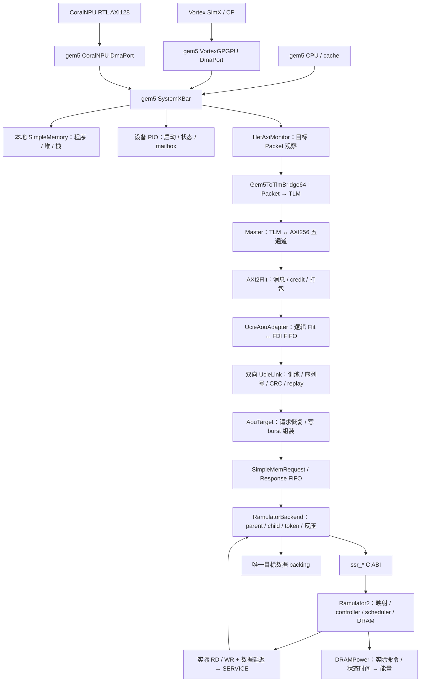

# 当前项目的整体架构、文件职责和前后接口

本解读以 `ae481cb6` 的在线 Ramulator2 接入及当前工作区源码为基础。01—08 保存替代前的分析和设计依据；这里解释已经运行的系统。核心集成文件按实际连接逐项说明，大型上游工程按子系统说明；[当前全文件清单](current-file-map.csv)覆盖主仓库与已初始化的 Vortex 递归子模块。清单中的目录分类不代表每个上游函数都经过逐行人工审阅，也不是完整调用图。

## 1. 整个项目解决什么问题

这是一个异构计算设备访问远端内存的在线联合仿真平台。CPU 执行程序，GPU 使用 Vortex SimX，NPU 使用 CoralNPU 的 Verilator RTL；三者的目标访存最终进入同一条 AXI256/UCIe 链路和同一个 RamulatorBackend 实例。Ramulator2 决定实际 DRAM 命令及服务时间，backing 保存真实字节，响应沿原路径返回。请求变慢会影响后续设备执行和请求产生时间。

因此，系统可以研究应用结果、端到端访存等待、协议反压与重放、DRAM 队列/行命中/刷新及估算能耗。在线仿真中的请求到达时间由设备执行共同决定，固定 trace 的离线回放是另一种分析方式。

图中主方向展示请求关系；每个目标请求的响应经过 FIFO、AouTarget、反向 UCIe、AXI2Flit、AXI R/B、TLM 和 gem5 Packet 返回发起方。PIO 和本地主存由地址解码选择，属于另外两条访问路径。

## 2. 目录归属与哪些代码参与运行

| 目录 | 主要职责 | 当前在线系统中的位置 |
|---|---|---|
| `env/` | 固定依赖、准备工具链、构建、记录环境、执行验收 | 构建期和仿真启动/检查期 |
| `gem5/` | CPU、cache、Packet/port、互连、SE、事件队列、原生 SystemC/TLM | 单进程仿真的基础框架 |
| `gem5_new/` | GPU/NPU 设备真源、C ABI、观察器、设备工作负载和工具 | 设备接入及验证 |
| `gem5_axi/` | 系统配置、TLM→真实 AXI、在线链路装配、后端桥接 | 系统集成中心 |
| `axi2flit/` | AXI/AoU 转换、消息编解码、credit、远端 target | 互连协议层 |
| `protocol/include/` | 两端共享的逻辑/物理 AoU 帧映射 | AXI2Flit 与 UCIe 共用契约 |
| `ucie-model/` | 双向链路行为、串行传输、错误与可靠性机制 | 链路层/行为物理层 |
| `ramulator2/` | DRAM 控制器、组织、时序、调度、命令及 DRAMPower | 在线内存时序和功耗模型 |
| `coralnpu/` | Chisel/RTL、Verilator wrapper、Bazel 规则和 NPU 测试 | 构建后加载原生 RTL 动态库 |
| `vortex-gpu/vortex/` | Vortex 外部工程、SimX、runtime、kernel | 构建后加载 SimX 动态库 |
| `docs/` | 系统说明、源码解读和验证解释 | 文档，不驱动调度 |

内部目录是主仓库普通源码；Vortex 及其递归依赖是外部子模块。`results/`、`build/`、Bazel 输出和用户目录依赖缓存是运行/构建产物，不属于源码职责清单。`mem_sim/` 已移除；剩余 `memsim_*` 文件保存可选历史接入，不是当前默认运行的后端。

上下游实际跨越的接口如下：

| 边界 | 请求接口与内容 | 返回接口与完成条件 |
|---|---|---|
| CoralNPU RTL↔设备库↔gem5 设备壳 | 原生 AXI128 经 wrapper 的异步 timing callback，包含地址/ID/16B 数据/strobe | ABI `complete_read/write` 注入 R/B；整次系统 DMA 完成后才调用 |
| Vortex core/CP↔gem5 设备壳 | core timing callback 带 token；CP 使用内存 callback+coroutine | core `complete_core_memory`；CP DMA 完成后恢复 continuation |
| CPU/DmaPort↔gem5 XBar | RequestPort→ResponsePort，`sendTimingReq(PacketPtr)`；地址、大小、数据、byte-enable、requestor | `sendTimingResp`；接收返回 bool，不接受则保留并等 retry |
| XBar↔monitor↔bridge | monitor `cpu_side_port/mem_side_port` 透明转发，bridge `gem5` port 接收 Packet | 原 Packet response，monitor 成功交付后记录完成 |
| bridge↔Master | `tlm_generic_payload`、`nb_transport_fw(BEGIN_REQ)`；command/address/data/length/byte-enable/extension | `END_REQ` 只表示接收；`BEGIN_RESP/END_RESP` 表示响应与最终退休 |
| Master↔AoU Fabric | AW/W/AR valid-ready、地址/ID/LEN/SIZE、256bit 数据/32bit WSTRB | B/R valid-ready、BRESP/RRESP、RID/BID、RLAST；全 segment 后完成 payload |
| AXI2Flit↔UcieAouAdapter | `FlitTransfer` ready/valid，250B 逻辑 AoU、消息/credit | 返回逻辑 response Flit，再转换为 AXI R/B |
| adapter/Target↔UcieLink | 四端口 `sc_fifo<FdiFlit>`；250B payload 与仅用于观察的 metadata | 收帧校验/顺序正确才交付 FDI；错误触发 ACK/NAK/replay 机制 |
| AouTarget↔RamulatorBackend | `sc_fifo<SimpleMemRequest>`；完整 burst、RP、AXI address、全部写 beat/掩码 | `SimpleMemResponse`；ID/RP/status、读 beat；parent 完成才入 FIFO |
| backend↔native Ramulator2 | `ssr_submit(token,aligned_relative_addr,write)`；不传用户字节；1 接收/0 反压/-1 错误 | step 后 poll `ssr_event`；ISSUE 是实际命令，SERVICE 是数据可服务时间 |
| backend↔TargetBackingStore | SERVICE 时调用 `write(addr,bytes,data,mask)` 或 `read(addr,bytes,data)` | 唯一实际字节更新或读快照；之后可等待返回链路 |
| controller↔DRAMPower | 实际 `on_issue(Request)` 映射命令/坐标/时间，匹配 memspec | PowerStats 的能量/窗口/计数，finish 导出 JSON；不驱动响应 |

各层的接受与完成彼此不同；数据指针/临时对象的寿命也必须跨越排队与重试。统一 backing 的持久所有权在 backend，native C ABI 和 observer 不复制一份用户 RAM。

## 3. 环境、构建和系统配置文件

| 文件 | 作用 | 输入 / 上游 | 输出 / 下游 |
|---|---|---|---|
| [AGENTS.md](../../AGENTS.md) | 源码归属、时间基准、维护与验收约定 | 项目维护要求 | 开发与交接行为 |
| [env/activate.sh](../../env/activate.sh) | 激活唯一工具环境，设置源码、库、构建和运行路径 | `SS_DEPS_ROOT`、已安装工具链 | `AXI_*`、`RAMULATOR_*` 等变量 |
| [env/bootstrap.sh](../../env/bootstrap.sh) | 按锁准备 CPU 基础工具链和原生 DRAM 依赖 | conda/native 锁、下载缓存 | 用户目录工具环境与源码缓存 |
| [env/bootstrap_xpu.sh](../../env/bootstrap_xpu.sh) | 包含基础 bootstrap，另准备 Vortex、Bazel、LZ4、sysroot | XPU 下载锁 | GPU/NPU 构建依赖 |
| [env/build.sh](../../env/build.sh) | 串行化共享构建；刷新设备，构建 native Ramulator2，再执行 SCons | 普通源码、缓存和所选后端 | native 库、`gem5/build/AXI/gem5.opt` |
| [env/build_xpu.sh](../../env/build_xpu.sh) | 构建 Vortex SimX/runtime/kernel、CoralNPU RTL/kernel，再调用基础 build | XPU 源码、工具链、保存的外部补丁 | GPU/NPU 动态库与工作负载 |
| [env/check_sources.py](../../env/check_sources.py) | 检查普通源码归属、必要文件和外部锁定 revision | 本地源码/Git metadata、backend/XPU 选择 | 构建前明确检查结果 |
| [env/prepare_ramulator_sources.py](../../env/prepare_ramulator_sources.py) | 校验 SHA256 并展开 native 依赖，build 的 `--check` 不下载 | 锁定 archive | 不含嵌套 Git 的源码缓存 |
| [env/prepare_cmake_sources.py](../../env/prepare_cmake_sources.py) | 准备 Vortex 构建的固定 CMake 依赖源码 | XPU artifact 锁 | Vortex 原生依赖缓存 |
| [env/fetch_vortex_tools.py](../../env/fetch_vortex_tools.py) | 下载并校验固定的 Vortex 交叉工具包 | 固定版本/分片哈希 | RISC-V LLVM/GNU 工具 |
| [env/prepare_vortex_llvm.py](../../env/prepare_vortex_llvm.py) | 为工具选择配套 loader/RPATH，处理主机 libc 差异 | 下载的 LLVM、主机版本 | 可执行的交叉工具 |
| [env/generate_ramulator_config.py](../../env/generate_ramulator_config.py) | 两个在线配置共用的后端选项、HBM4 展开与 memspec 生成 | channels/queue/scale/power 或自定义配置 | 原生配置、memspec、哈希与元数据 |
| [env/dependency_bundle.py](../../env/dependency_bundle.py) | 打包/检查/恢复固定工具与下载缓存 | 锁文件、缓存 | 可交接依赖包 |
| [env/conda-linux-64.lock](../../env/conda-linux-64.lock) | 固定 GCC/Python/SCons 等基础工具包 | 版本管理 | bootstrap 和环境审计 |
| [env/ramulator-artifacts.lock.json](../../env/ramulator-artifacts.lock.json) | 固定 yaml-cpp/fmt/DRAMUtils/json archive 与 SHA256 | native 依赖版本 | 原生模型可重复构建 |
| [env/sources.lock.json](../../env/sources.lock.json) | 固定外部源码 revision | 外部源码版本 | 子模块检查 |
| [env/xpu-artifacts.lock.json](../../env/xpu-artifacts.lock.json)、[env/xpu-runtime-linux-64.lock](../../env/xpu-runtime-linux-64.lock) | 固定 XPU 下载与私有工具运行环境 | 工具版本 | XPU bootstrap/审计 |
| [env/vendored_sources.json](../../env/vendored_sources.json)、[env/internal_imports.json](../../env/internal_imports.json)、[env/upload_sources.json](../../env/upload_sources.json) | 记录导入来源与历史边界 | 源码迁移记录 | 追溯；不决定 DRAM 服务时间 |
| [gem5_axi/configs/run.py](../../gem5_axi/configs/run.py) | 定向 tester / 独立 CPU 系统装配 | CLI 参数、CPU binary | 连接 bridge、AxiDemo、monitor 和本地主存 |
| [gem5_axi/configs/run_xpu.py](../../gem5_axi/configs/run_xpu.py) | Host + 可选 GPU/NPU 全链路装配 | 工作负载、设备库/kernel、backend 配置 | 三源、目标路由、单个在线后端 |
| [gem5_new/gem5int/configs/het/het_system.py](../../gem5_new/gem5int/configs/het/het_system.py) | 共用 CPU/cache/device 创建函数、地址与时钟常量 | 当前配置调用 `build_*` 等函数 | XPU 前端对象；其独立 `main` 是另一配置 |
| [gem5_axi/Gem5Axi.py](../../gem5_axi/Gem5Axi.py) | 定义 AxiDemo/AxiPacketTester 的参数、端口和 C++ 映射 | m5 Python 配置 | 自动生成 C++ Params 和 SimObject |
| [gem5_axi/SConscript](../../gem5_axi/SConscript) | 将集成源码编进 gem5，链接独立命名的 native 库 | SCons、`SS_HAVE_MEMSIM` | 单一 gem5/SystemC executable |

`run.py` 为兼容原测试仍默认 `backend=ram,memory_backend=simple`；当前 CPU 验收入口显式指定 `aou + ramulator2`。`run_xpu.py` 默认使用在线 Ramulator2。仅改变 `SS_MEMORY_BACKEND` 不等于所有历史配置自动更换拓扑。

## 4. CPU、GPU、NPU 如何生成请求

### 4.1 gem5 与原生时间基础

| 文件 | 作用 | 输入 / 上游 | 输出 / 下游 |
|---|---|---|---|
| [gem5/src/cpu/simple/timing.cc](../../gem5/src/cpu/simple/timing.cc) | TimingSimpleCPU 的取指、访存等待和恢复 | Host 指令与请求 | Packet；响应后推进 CPU |
| [gem5/src/mem/request.hh](../../gem5/src/mem/request.hh) | 地址、requestor、字节使能、stream 等请求属性 | CPU/DMA | Packet 和后续转换属性 |
| [gem5/src/mem/packet.hh](../../gem5/src/mem/packet.hh) | 命令、数据、response、SenderState | Request、发起方缓冲区 | 互连/bridge；原请求关联 |
| [gem5/src/mem/port.hh](../../gem5/src/mem/port.hh) | RequestPort/ResponsePort 的双端连接与 timing/retry 契约 | SimObject 绑定 | 请求及响应回调 |
| [gem5/src/mem/xbar.hh](../../gem5/src/mem/xbar.hh) | 地址路由、仲裁、互连注释延迟的基础实现 | CPU/DMA ports | 本地内存、PIO 或目标 bridge |
| [gem5/src/dev/dma_device.hh](../../gem5/src/dev/dma_device.hh)、[.cc](../../gem5/src/dev/dma_device.cc) | GPU/NPU 共用 DmaDevice/DmaPort；拆分 Packet、保留掩码、完成整次 DMA | 设备请求与 completion event | 系统 timing Packet / 整次 DMA 完成 |
| [gem5/src/systemc/core/kernel.cc](../../gem5/src/systemc/core/kernel.cc)、[scheduler.cc](../../gem5/src/systemc/core/scheduler.cc)、[sc_time.cc](../../gem5/src/systemc/core/sc_time.cc) | 将 SystemC process/delta/timeout 纳入 gem5 队列并共享 tick | SystemC wait/notify 与 gem5 EventQueue | 同一仿真时间和进程调度 |
| [gem5/src/systemc/tlm_bridge/gem5_to_tlm.hh](../../gem5/src/systemc/tlm_bridge/gem5_to_tlm.hh)、[.cc](../../gem5/src/systemc/tlm_bridge/gem5_to_tlm.cc) | Packet↔payload、四阶段、响应重试及原 Packet 关联 | 目标 Packet | `BEGIN_REQ`；反向响应返回原 Packet |

CPU 程序、栈和普通页使用本地主存。目标缓冲区设为 uncacheable，使设备共享测试里的字节操作真正到达目标后端。当前 XPU 默认 CPU 2GHz、Vortex 1GHz、NPU 500MHz，三者与 AXI/native DRAM 时钟共用 1fs 时间轴。

### 4.2 NPU 文件与接口

| 文件 | 作用 | 输入 / 上游 | 输出 / 下游 |
|---|---|---|---|
| [gem5_new/gem5int/src/dev/coralnpu/CoralNPU.py](../../gem5_new/gem5int/src/dev/coralnpu/CoralNPU.py) | NPU SimObject 参数、library/kernel、PIO/DMA 配置 | Python 系统配置 | gem5 Params |
| [coralnpu_dev.hh](../../gem5_new/gem5int/src/dev/coralnpu/coralnpu_dev.hh)、[.cc](../../gem5_new/gem5int/src/dev/coralnpu/coralnpu_dev.cc) | 加载 RTL C ABI；PIO 启动/状态；周期 step；sequence、同 ID 退休、掩码 DMA | Host PIO、RTL timing callbacks | `dmaRead/Write`；完成后 `complete_read/write` |
| [gem5_new/coralnpuint/coralnpu_gem5.h](../../gem5_new/coralnpuint/coralnpu_gem5.h)、[.cc](../../gem5_new/coralnpuint/coralnpu_gem5.cc) | 设备库 C ABI 真源；隔离 Verilator 类型，注册异步 request/response | gem5 库调用 | wrapper request 与 RTL R/B 注入 |
| [gem5_new/coralnpuint/install.sh](../../gem5_new/coralnpuint/install.sh) | 刷新主仓库 CoralNPU 的 ABI 构建副本；本地分支不重复打基础补丁 | 真源文件和共享 trace 头 | `coralnpu/gem5int/` 构建 package |
| [coralnpu/gem5int/coralnpu_gem5.h](../../coralnpu/gem5int/coralnpu_gem5.h)、[.cc](../../coralnpu/gem5int/coralnpu_gem5.cc)、[BUILD](../../coralnpu/gem5int/BUILD) | 实际 Bazel package 中的 ABI 副本和库规则 | install 的刷新、Verilator 输出 | `libcoralnpu-gem5.so` |
| [coralnpu/hw_sim/core_mini_axi_wrapper.h](../../coralnpu/hw_sim/core_mini_axi_wrapper.h) | 驱动 CoreMiniAxi 的时钟/复位/AXI，异步服务外存响应 | RTL pin 和 timing backend | 16B AXI 请求；延后 R/B |
| [coralnpu/hw_sim/hw_primitives.h](../../coralnpu/hw_sim/hw_primitives.h)、[.cc](../../coralnpu/hw_sim/hw_primitives.cc) | AXI/时钟等仿真 driver primitive，暂存异步响应 | wrapper 和完成通知 | RTL READY/VALID/数据 |
| [CoreAxi.scala](../../coralnpu/hdl/chisel/src/coralnpu/CoreAxi.scala)、[Core.scala](../../coralnpu/hdl/chisel/src/coralnpu/Core.scala) | 硬件 core/AXI 集成 | Chisel 参数、指令/内部总线 | 生成 RTL 结构 |
| [DBus2Axi.scala](../../coralnpu/hdl/chisel/src/coralnpu/DBus2Axi.scala)、[IBus2Axi.scala](../../coralnpu/hdl/chisel/src/coralnpu/IBus2Axi.scala) | 硬件内部数据/指令总线到 AXI 的转换 | core bus | 外部 AXI |
| [gem5_new/coralnpuint/ddr_touch.cc](../../gem5_new/coralnpuint/ddr_touch.cc) | 验收 kernel：读输入、计算、写结果和 mailbox | Host 初始化的共享字节 | 可检查的 NPU 输出与校验和 |

NPU 原生外存 beat 为 16B，设备壳将有效字节和 16bit strobe 转成 gem5 DMA。后面的 Master 才产生 256bit AXI lane/WSTRB；这不是直接把原 RTL 引脚接到 AXI2Flit。NPU 不会因 C callback 返回就拿到 R/B，必须等原链路响应与 DMA 完成。ELF/TCM 初始化发生在定时执行前，当前每次仿真支持一次启动。

### 4.3 GPU 文件与接口

| 文件 | 作用 | 输入 / 上游 | 输出 / 下游 |
|---|---|---|---|
| [gem5_new/gem5int/src/dev/vortex/VortexGPGPU.py](../../gem5_new/gem5int/src/dev/vortex/VortexGPGPU.py) | GPU library、时钟、CP/VRAM、timing 参数 | 系统配置 | gem5 Params |
| [vortex_gpgpu_dev.hh](../../gem5_new/gem5int/src/dev/vortex/vortex_gpgpu_dev.hh)、[.cc](../../gem5_new/gem5int/src/dev/vortex/vortex_gpgpu_dev.cc) | SimX/CP 设备壳；core token 并发 DMA；CP coroutine；PIO；完成反馈 | SimX core/CP、Host 操作 | 系统 timing 请求与 ABI 完成 |
| [vortex-gpu/vortex/sim/simx/gem5/vortex_gpgpu.h](../../vortex-gpu/vortex/sim/simx/gem5/vortex_gpgpu.h)、[.cpp](../../vortex-gpu/vortex/sim/simx/gem5/vortex_gpgpu.cpp) | 外部 SimX C ABI、CP/core timing seam | gem5 的 create/tick/backend 注册 | SimX 周期和待完成访存 |
| [processor.h](../../vortex-gpu/vortex/sim/simx/processor.h)、[processor.cpp](../../vortex-gpu/vortex/sim/simx/processor.cpp)、[processor_impl.h](../../vortex-gpu/vortex/sim/simx/processor_impl.h) | SimX processor 集成、core/cache/memory 连通和 timing backend 注册 | GPU 执行状态 | 内存子系统与 core completion |
| [memory.h](../../vortex-gpu/vortex/sim/simx/mem/memory.h)、[memory.cpp](../../vortex-gpu/vortex/sim/simx/mem/memory.cpp) | GPU 外存边界；异步请求和返回数据接入 | SimX cache/访存 | gem5 callback；完成后 MemRsp |
| [core.cpp](../../vortex-gpu/vortex/sim/simx/core.cpp)、[lsu_unit.cpp](../../vortex-gpu/vortex/sim/simx/lsu_unit.cpp) | GPU 指令/LSU 执行及等待 | warp 指令和操作数 | cache/访存请求，返回后继续 |
| [gem5_new/vortexint/install.sh](../../gem5_new/vortexint/install.sh) | 幂等应用外部适配，安装 trace 头 | 固定上游版本和保存补丁 | 可编译的 SimX ABI |
| [simx_online.patch](../../gem5_new/vortexint/patches/simx_online.patch) | 保存 core 外存 timing、CP 等必要上游差异 | 锁定 Vortex 源码 | 在线访存适配 |
| [runtime_assert_header.patch](../../gem5_new/vortexint/patches/runtime_assert_header.patch) | 修复 runtime 头宏与锁定 sysroot 的包含顺序冲突 | 上游 runtime 头 | 可重复的 Host runtime 构建 |
| [tests/regression/vecadd/main.cpp](../../vortex-gpu/vortex/tests/regression/vecadd/main.cpp)、[kernel.cpp](../../vortex-gpu/vortex/tests/regression/vecadd/kernel.cpp) | GPU Host runtime 与向量加法 kernel 验收 | Host 输入、kernel binary | GPU 正确性结果 |

GPU core 请求可并发，token 关联响应；CP 的同步式 ABI 在设备壳中通过 coroutine 让出调度，等 DMA 后恢复。物理地址由 `pinAddr + device_addr` 得到。timing 模式下 BAR 由目标内存 responder 所有，GPU PIO 只负责 CP 等控制，防止两个数据真源。

## 5. TLM、真实 AXI 和 AoU 协议层文件

| 文件 | 作用 | 输入 / 上游 | 输出 / 下游 |
|---|---|---|---|
| [gem5_axi/axi_demo.hh](../../gem5_axi/axi_demo.hh)、[.cc](../../gem5_axi/axi_demo.cc) | SystemC 容器；端口 wrapper、时钟/复位、Packet 转换 hook、VCD 和 finish | SimObject Params/TLM port | Master、RAM 或 AoU fabric |
| [axi_master.hh](../../gem5_axi/axi_master.hh)、[.cc](../../gem5_axi/axi_master.cc) | 接收 payload；保留内存管理引用；分段、ID、五通道握手；响应回填 | TLM 四阶段、byte-enable/metadata | 真实 AXI；全部 segment 后 `BEGIN_RESP` |
| [axi_signals.hh](../../gem5_axi/axi_signals.hh) | 统一 AXI256 信号、master/slave 绑定与 tracing | 两端 SystemC port | 同一总线信号与 VCD |
| [aou_backend.hh](../../gem5_axi/aou_backend.hh)、[.cc](../../gem5_axi/aou_backend.cc) | 在线 fabric 的总接线处；AXI 类型适配、双向链路、target、backend、日志 | AXI 五通道和配置 | 协议请求/响应、统计与完整 Flit 记录 |
| [aou_axi2flit.cc](../../gem5_axi/aou_axi2flit.cc)、[aou_flit_packer.cc](../../gem5_axi/aou_flit_packer.cc)、[aou_flit_unpacker.cc](../../gem5_axi/aou_flit_unpacker.cc) | 编译桥：include AXI2Flit 原实现，使用 gem5 原生 SystemC | 下方独立模块源码 | SCons 中的对象文件；不是第二套实现 |
| [axi2flit/systemc/include/axi_if.h](../../axi2flit/systemc/include/axi_if.h) | AXI 地址/数据/响应结构与 32B lane 定义 | AXI pin/type adapter | AXI2Flit/AouTarget 共用属性 |
| [axi_contract.h](../../axi2flit/systemc/include/axi_contract.h) | 支持的 burst/对齐/属性约束检查 | AxChannel | 合法访问或明确错误 |
| [axi2flit.h](../../axi2flit/systemc/include/axi2flit.h)、[src/axi2flit.cpp](../../axi2flit/systemc/src/axi2flit.cpp) | 捕获五通道，维护请求/数据顺序、resource plane 和 credit | AXI 地址/写数据，入站回复 Flit | 出站请求 Flit、AXI R/B |
| [aou_types.h](../../axi2flit/systemc/include/aou_types.h) | MsgType、消息长度/字段、FlitTransfer、granule 结构 | 协议定义 | 所有打包/解包模块 |
| [msg_builder.h](../../axi2flit/systemc/include/msg_builder.h) | 请求/数据/响应到 AoU 消息字段编码 | AXI channel / mem response | AoU message |
| [msg_decoder.h](../../axi2flit/systemc/include/msg_decoder.h) | 消息字段还原地址、数据、选通和状态 | AoU message | AXI 或 FIFO 事务字段 |
| [flit_packer.h](../../axi2flit/systemc/include/flit_packer.h)、[src/flit_packer.cpp](../../axi2flit/systemc/src/flit_packer.cpp) | 消息按 5B granule 装帧；携带 credit，处理跨帧 | 待发送消息 | 逻辑 AoU Flit |
| [flit_unpacker.h](../../axi2flit/systemc/include/flit_unpacker.h)、[src/flit_unpacker.cpp](../../axi2flit/systemc/src/flit_unpacker.cpp) | 收帧恢复消息与响应 | 入站逻辑 Flit | AXI 返回消息与 credit 更新 |
| [aou_stream_decoder.h](../../axi2flit/systemc/include/aou_stream_decoder.h) | 跨帧消息的 carry 与结构解析 | 连续逻辑帧 | 完整消息序列 |
| [aou_wire.h](../../axi2flit/systemc/include/aou_wire.h) | 逻辑 Flit 的 250B 序列化/反序列化 | AoU Flit 对象 | byte array / 还原对象 |
| [credit_manager.h](../../axi2flit/systemc/include/credit_manager.h) | 每 resource plane、消息种类的容量授权与归还 | credit grant/return、发送需求 | 可发送条件、待返回 credit |
| [rp_order_guard.h](../../axi2flit/systemc/include/rp_order_guard.h) | resource plane 中的顺序约束 | AXI 请求与返回关联 | 有序接收/退休检查 |
| [link_config.h](../../axi2flit/systemc/include/link_config.h) | 编译期链路宽度/速率/调制等公共选择 | 编译配置 | 打包与 UCIe 一致性检查 |
| [protocol/include/aou_format6.h](../../protocol/include/aou_format6.h) | 固定 `scatter/gather`：250B 逻辑帧↔256B 物理帧 | 逻辑 payload、FH、CRC | 两端一致的物理布局 |

Master 的一个 payload 可拆成多个 AXI burst，每 burst 不跨 4KiB、最多 256 beat，按地址和剩余长度选择合法窄/宽 beat。真实 WDATA/RDATA=256bit、WSTRB=32bit。`Bridge64/socket64` 是原生端口绑定参数，不限制 payload 长度，也不定义这条总线位宽。

AoU 的 250B 包含 10B 协议头与 240B 消息区，后者是 48 个 5B granule；物理 256B 另外携带 FH/CRC。不能把 250B 全称为用户数据，也不能把一帧当作一个内存请求。AoU resource plane 和 DRAM channel 是不同机制，当前 `id % planes` 的桥接路由策略不等于 DRAM channel 选择。

## 6. UCIe 与 AouTarget 的实际边界

| 文件 | 作用 | 输入 / 上游 | 输出 / 下游 |
|---|---|---|---|
| [axi2flit/systemc/integration/ucie_aou_adapter.h](../../axi2flit/systemc/integration/ucie_aou_adapter.h) | `FlitTransfer` ready/valid↔FDI FIFO；250B 编解码；训练状态门控 | AXI2Flit 与 link state | SoC 端 `soc_tx/soc_rx` |
| [ucie-model/src/ucie_common.h](../../ucie-model/src/ucie_common.h) | 链路配置、格式、物理帧编解码、CRC 和统计基础结构 | 统一 config、FDI payload/帧头 | 链路/PHY 参数、物理帧及接收解析 |
| [ucie_fdi.h](../../ucie-model/src/ucie_fdi.h) | FdiFlit 的 payload、有效长度和观察 metadata | adapter/target | Link 的逻辑业务输入输出 |
| [ucie_link.h](../../ucie-model/src/ucie_link.h) | UcieLink 组合 Tx/Rx、双方向 FIFO、反馈与状态；序列/CRC/replay | 四个端点 FDI FIFO | 正确交付帧或可靠性反馈 |
| [ucie_phy.h](../../ucie-model/src/ucie_phy.h) | lanes/串行化、编码、信道误差等行为模型 | 物理 frame、PHY 参数 | 带传输时间/误差的接收 frame |
| [axi2flit/systemc/integration/aou_target.h](../../axi2flit/systemc/integration/aou_target.h) | `AouTarget`；解析请求，按 RP 组装完整写 burst，提交 FIFO并编码返回 | `link_rx`、backend `mem_rsp` | `mem_req`、反向 `link_tx` |
| [simple_mem_if.h](../../axi2flit/systemc/include/simple_mem_if.h) | 整笔 burst 请求/响应契约，写 beat 数据/掩码、读 beat 状态 | Target 事务 | 任一实现该 FIFO 契约的后端 |

总接线在 `aou_backend.cc`：`soc_tx/soc_rx` 和 `mem_tx/mem_rx` 每个 FIFO 容量为 8；target→backend 的 requests/responses FIFO 各为 4。AouTarget 的 `mem_req` 是输出端口，`mem_rsp` 是输入端口；RamulatorBackend 分别以 `request` 输入、`response` 输出绑定同一对 FIFO。

AouTarget 每 RP 预留读/写请求槽和写数据 credit。写 beat 搬入已预留的完整 burst 存储后可以归还数据 credit，长 burst 因而能分批到达。只有完整请求才交给后端；FIFO 接受表示排队，响应才表示操作完成。返回时又受响应 credit、发送 FIFO和链路约束。

当前 fabric 正常用例把噪声等信道参数设为零，replay 用例注入确定性的 2% 物理帧错误。UCIe 是行为级链路模型，不是商用硬 PHY 的电路/功耗签核模型。

## 7. RamulatorBackend、真实数据与原生 DRAM

| 文件 | 作用 | 输入 / 上游 | 输出 / 下游 |
|---|---|---|---|
| [gem5_axi/ramulator_backend.hh](../../gem5_axi/ramulator_backend.hh) | 定义 Burst/Descriptor/Child、FIFO port、active/hazard 状态 | SimpleMem 类型和 native ABI | SystemC backend 状态机 |
| [ramulator_backend.cc](../../gem5_axi/ramulator_backend.cc) | `accept/submit/process/run/finish`；整体校验、拆分、重试、服务、响应与排空 | 完整 AXI parent / native event | child 请求、backing 更新、parent response |
| [target_backing_store.hh](../../gem5_axi/target_backing_store.hh) | 64bit 相对地址、零初始化稀疏 4KiB 页、masked write | SERVICE 时的有效字节/掩码 | 真实读快照和最终内存 image |
| [ramulator2/integration/online.h](../../ramulator2/integration/online.h) | SSR_ABI_VERSION、info/event 和九个扁平 C 函数 | caller 的配置、token、相对地址 | 能力、反压、ISSUE/SERVICE 和错误 |
| [online.cpp](../../ramulator2/integration/online.cpp) | 创建 External/GenericDRAM；被动观察 issue；定时服务队列；统计与功耗导出 | ABI 调用、controller actual issue | native event 与模型/功耗报告 |
| [online.map](../../ramulator2/integration/online.map) | 链接版本脚本，仅导出 `ssr_*` | native linker | 隐藏 C++ 符号，避免 Vortex 内部模型冲突 |
| [ramulator2/CMakeLists.txt](../../ramulator2/CMakeLists.txt) | native 模型/DRAMPower/可选 Python binding/在线库构建规则 | CMake 与固定源码依赖 | 独立命名 `.so` 和原生测试 |
| [base/request.h](../../ramulator2/src/ramulator/base/request.h) | 原生读写、地址层级、最终命令、callback、集成 token | child 提交与映射 | controller 队列和 actual issue 关联 |
| [base/config.cpp](../../ramulator2/src/ramulator/base/config.cpp)、[factory.cpp](../../ramulator2/src/ramulator/base/factory.cpp) | 配置解析、按 impl 工厂创建对象；错误跨 ABI 转为报告 | 展开 YAML/JSON | 模型对象树 |
| [frontend/impl/external.cpp](../../ramulator2/src/ramulator/frontend/impl/external.cpp) | 外部接入的 frontend 生命周期/统计/连接 | Factory 和 memory system | 外部驱动的模型环境 |
| [memory_system/i_memory_system.h](../../ramulator2/src/ramulator/memory_system/i_memory_system.h)、[impl/generic_dram_system.cpp](../../ramulator2/src/ramulator/memory_system/impl/generic_dram_system.cpp) | send/tick/能力边界；每 controller 一个 channel；聚合统计 | 原生 child Request | channel mapper、controller |
| [channel_mapper/impl/cache_line_interleave.cpp](../../ramulator2/src/ramulator/memory_system/channel_mapper/impl/cache_line_interleave.cpp) | transaction 粒度选择 channel并产生通道内地址 | 对齐的相对地址 | `addr_vec[0]`、intra-channel address |
| [controller/controller_base.h](../../ramulator2/src/ramulator/controller/controller_base.h)、[.cpp](../../ramulator2/src/ramulator/controller/controller_base.cpp) | 队列、调度公共逻辑、actual issue/observer、待完成读、power reporter | Request、scheduler/refresh | DRAM command、native callback、observer |
| [impl/hbm34_controller.cpp](../../ramulator2/src/ramulator/controller/impl/hbm34_controller.cpp)、[hbm_controller_base.cpp](../../ramulator2/src/ramulator/controller/impl/hbm_controller_base.cpp) | HBM3/4 controller 与 HBM 周期推进 | 通道队列、HBM spec | 合法实际命令和退休行为 |
| [scheduler/impl/frfcfs_rowhit.cpp](../../ramulator2/src/ramulator/controller/scheduler/impl/frfcfs_rowhit.cpp) | 行命中/就绪优先的 FRFCFS 候选选择 | controller 队列与 DRAM 状态 | 调度候选；不是固定延迟模型 |
| [refresh/impl/hbm34_per_bank_refresh.cpp](../../ramulator2/src/ramulator/controller/refresh/impl/hbm34_per_bank_refresh.cpp) | HBM 周期性 per-bank refresh | native tick 和刷新参数 | 维护请求/命令 |
| [rowpolicy/impl/open.cpp](../../ramulator2/src/ramulator/controller/rowpolicy/impl/open.cpp) | Open row policy | 实际 issue 和 bank 状态 | 行保持策略 |
| [addr_mapper/impl/ro_ba_ra_co_ch.cpp](../../ramulator2/src/ramulator/controller/addr_mapper/impl/ro_ba_ra_co_ch.cpp) | 通道内地址到组织坐标 | intra-channel address、组织位数 | PC/SID/BG/Bank/Row/Column 等地址层级 |
| [dram/dram_spec.h](../../ramulator2/src/ramulator/dram/dram_spec.h)、[.cpp](../../ramulator2/src/ramulator/dram/dram_spec.cpp) | 组织、命令、timing constraint、终端延迟的标准接口 | DRAM 参数与标准实现 | controller/device 共用解析后模型 |
| [dram/device.cpp](../../ramulator2/src/ramulator/dram/device.cpp)、[node.cpp](../../ramulator2/src/ramulator/dram/node.cpp) | 地址层级节点、bank/row 状态、前置命令、ready time 与 issue 状态更新 | 调度候选和时序规则 | 是否可发、ACT/PRE/RD/WR/REF 状态变化 |
| [python/ramulator/dram/hbm4.py](../../ramulator2/python/ramulator/dram/hbm4.py)、[spec.py](../../ramulator2/python/ramulator/dram/spec.py) | HBM4 preset/DSL、组织/timing 解析 | preset + overrides | 生成配置与标准定义；不保存字节 |
| [python/ramulator/codegen.py](../../ramulator2/python/ramulator/codegen.py) | DSL/包装器代码生成 | DRAM/配置定义 | C++/Python 生成源码；当前在线嵌入构建不运行 Python binding codegen |

### 7.1 parent、child、token 与时钟循环

parent 是 FIFO 收到的一笔完整 AXI burst；child 是按 DRAM transaction 边界切出的有效子段；token 是 child 的唯一关联号。AXI ID 可以复用，不适合单独作为 native 全局关联号。

`accept()` 先检查整笔范围和 strobe，再为全部 child 预留同址 hazard。默认最多 8 parent、32 在途 child；每个 parent 的最大 burst 长度受 AXI 约束，临时数据有界。年轻 parent 不会越过尚未提交的早期同 transaction child。

每个 native tick，`run()` 依次 step→poll/处理命令和服务→尝试返回队首 parent→接收至多一个 parent→提交至多一个 child。native 满时保留相同 token 重试；响应满/保留时 native 继续推进，背景和 refresh 继续统计。

同 transaction 从提交到 SERVICE 串行化，避免原生同址写合并/读转发破坏当前字节服务契约；不同 transaction 可并发。parent 以全局 FIFO 返回，强于同 ID 顺序要求。这是当前桥接策略，性能研究时要保留这个条件。

### 7.2 三类模型各保存什么

| 对象 | 持久拥有的状态 | 不承担的职责 |
|---|---|---|
| gem5 本地主存 | 程序、堆栈、普通 Host 页面 | 不自动覆盖远端目标窗口 |
| TargetBackingStore | 目标窗口实际字节、按需分配页面 | 不决定 DRAM 命令/延迟 |
| Ramulator2 | 队列、调度、组织坐标、行/bank 状态、timing、刷新 | 不保存用户 payload 字节 |
| DRAMPower | 命令及状态统计、电气参数、能量 | 不提供第二套独立访存调度器 |
| Packet/TLM/parent/读快照 | 在途临时数据与完成关联 | 不是另一份持久目标 RAM |

native observer 在实际 DRAM issue 后工作。RD 在 issue+read_latency 才产生 SERVICE，WR 在 issue+write_latency 才产生 SERVICE；写 callback 退休不直接等于 AXI B。SERVICE 时执行 masked write 或保存读快照，完整 parent 的 child 全部完成后才返回。

### 7.3 当前组织与地址边界

默认 HBM4 transaction=32B、native tick=250ps，read_latency=44 tick=11ns、write_latency=24 tick=6ns；单 controller 的可映射容量为 1GiB。native 从实际组织查询这些能力，不根据名字猜测。

`run.py` 的后端窗口为 `0x90000000 + 8KiB`，bridge 路由 16KiB 以保留越界测试。XPU 的本地 Host 页池为 `0x80000000 + 256MiB`；目标路由包括 shared `0x90000000 + 256MiB`、NPU work `0xb0000000 + 256MiB`，启用 GPU 再加 BAR `0x100000000 + 4GiB`。后端相对窗口未启用 GPU 时为 768MiB，启用时连地址孔洞为 5.75GiB；默认分别配置 2/8 controller，总容量 2/8GiB。

物理地址、目标相对地址和 native 组织坐标是三个表示。backend 以 `physical-base` 提交对齐 native transaction；有效 byte offset 仍保留在 child。窗口覆盖一个地址孔洞不等于上游为孔洞建立路由。

## 8. 功耗文件与实际口径

| 文件 | 作用 | 输入 / 上游 | 输出 / 下游 |
|---|---|---|---|
| [ramulator2/python/ramulator/power.py](../../ramulator2/python/ramulator/power.py) | 从 DRAM 对象派生组织/timing memspec，并明确估算电气参数/活动率 | 已解析 DRAM 对象 | matching memspec 与 fresh power plugin |
| [controller_plugin/dram_power.py](../../ramulator2/python/ramulator/controller_plugin/dram_power.py) | Python 配置层 plugin 包装 | memspec path、strict/interface 选择 | 原生 `DRAMPower` plugin 配置 |
| [controller/plugin/impl/drampower.cpp](../../ramulator2/src/ramulator/controller/plugin/impl/drampower.cpp) | `on_issue` 映射真实命令；参数校验；状态能量、reset/finalize/report | controller actual issue、memspec | PowerStats |
| [controller/plugin/power_reporter.h](../../ramulator2/src/ramulator/controller/plugin/power_reporter.h) | 可选功耗能力接口和能量分项 | plugin 实现 | controller/native ABI 的统一读取 |
| [HBM34.h](../../ramulator2/DRAMPower/src/DRAMPower/DRAMPower/standards/hbm34/HBM34.h)、[core_calculation_HBM34.cpp](../../ramulator2/DRAMPower/src/DRAMPower/DRAMPower/standards/hbm34/core_calculation_HBM34.cpp) | DRAMPower HBM 状态/命令与 core 能量计算 | 映射后的命令、窗口、电气参数 | activation/precharge/read/write/refresh/background 能量 |
| [MemSpecHBM34.cpp](../../ramulator2/DRAMPower/src/DRAMPower/DRAMPower/memspec/MemSpecHBM34.cpp) | 电气/组织/timing memspec 解析 | matching JSON | HBM 功耗模型参数 |

模型从 ACT/PRE/RD/WR/REF 等实际命令与状态时间统计功耗，不从 AXI burst 次数直接推算。多个 narrow/segmented 请求可能有不同 parent/child/命令计数。开启功耗只观察命令，不改变服务调度；本次验收比较了功耗开启/关闭的完整确定性轨迹。

报告分别给每 channel 与汇总 core/interface/total 能量和平均功率 `E/T`。统计窗口从零到最后完整 native tick，末尾不足一个周期的时间不纳入功耗；两种终止 tick 在 backend 摘要中保留并检查。

当前 memspec 含估算电气参数和固定活动率，绝对精度未校准。真实 backing 数据不自动变成逐 bit 精确 DQ/TSV 翻转功耗；DRAMPower 接口项也不等于完整 controller 逻辑功耗。当前结果不包含 CPU/GPU/NPU、AXI/UCIe 的整个系统功耗，也没有 DFI pin 波形。

## 9. 验证、观察与展示文件

| 文件 | 作用 | 输入 / 上游 | 输出 / 下游 |
|---|---|---|---|
| [env/run_ramulator.sh](../../env/run_ramulator.sh)、[verify_ramulator.py](../../env/verify_ramulator.py) | CPU/native/定向完整验收与跨配置反馈汇总 | 实际 binary/库、八种配置 | 根 summary 和完整用例目录 |
| [env/run_xpu.sh](../../env/run_xpu.sh)、[verify_xpu.py](../../env/verify_xpu.py) | NPU、GPU、三源、慢三源四组验收 | 已构建设备/kernel/Host workload | 设备结果、来源轨迹、闭环反馈汇总 |
| [env/run.sh](../../env/run.sh)、[verify_run.py](../../env/verify_run.py) | 原 RAM/AoU-simple 兼容与 CPU latency 反馈 | 原基线配置 | 兼容证据 |
| [env/record.py](../../env/record.py)、[record_xpu.py](../../env/record_xpu.py) | 记录源码/库/binary/锁哈希和实际加载依赖，审计 SystemC/符号 | 本次构建与工作区 | `environment/` 的可追溯证据 |
| [env/native_tests.py](../../env/native_tests.py) | 按所选后端确认 CTest 计划及成功计数 | 测试 plan/log | 原生验收门槛 |
| [gem5_axi/packet_tester.hh](../../gem5_axi/packet_tester.hh)、[.cc](../../gem5_axi/packet_tester.cc) | 生成窄/宽/掩码/跨界/错误请求和重试压力 | 测试模式 | gem5 Packet 与已知期望结果 |
| [workloads/ramulator_check.c](../../gem5_axi/workloads/ramulator_check.c) | 实际 CPU 程序验收 target 字节和边界 | CPU 加载的 binary | checksum/边界结果和 452 次访问 |
| [gem5_new/workloads/shared_buffer/host_main.c](../../gem5_new/workloads/shared_buffer/host_main.c) | Host 初始化共享输入并检查 NPU 字节交接 | NPU kernel 与共享区 | NPU 计算/共享结果 |
| [three_source/host_main.cpp](../../gem5_new/workloads/three_source/host_main.cpp) | Host 提交 GPU、启动 NPU、检查两设备计算 | 两种设备与分开的目标缓冲区 | 三源联合正确性 |
| [gem5_axi/scripts/check.py](../../gem5_axi/scripts/check.py) | Packet/TLM/真实 AXI 请求响应与字节检查 | transactions/axi_events | 基础功能/协议 summary |
| [check_aou.py](../../gem5_axi/scripts/check_aou.py) | Master 与 AXI2Flit/Target/AoU 计数和宽度关联 | AXI/AoU 日志与摘要 | 下游协议检查 |
| [inspect_link.py](../../gem5_axi/scripts/inspect_link.py) | 独立解码两端完整 Flit，关联消息、握手与时间 | 两端 raw hex/timestamp、AoU events | `axi_flit_path.csv` 和链路证据 |
| [check_ramulator.py](../../gem5_axi/scripts/check_ramulator.py) | 独立字节 scoreboard、token 因果、final image、bank 状态/timing、功耗汇总 | AXI/Flit + native commands/service/model/power | `ramulator_check.json` |
| [check_ramulator_negative.py](../../gem5_axi/scripts/check_ramulator_negative.py) | 篡改掩码/服务/响应/字节/命令时间/image/能量等负例 | 成功用例副本 | checker 必须拒绝的证明 |
| [check_aou_negative.py](../../gem5_axi/scripts/check_aou_negative.py)、[check_link_negative.py](../../gem5_axi/scripts/check_link_negative.py) | AoU 和物理帧/交付/时间篡改检查 | 成功基线副本 | 公共 checker 的负例 |
| [audit_wave.py](../../gem5_axi/scripts/audit_wave.py) | 从 VCD 独立重建五通道握手、稳定性与顺序 | 原生 SystemC VCD | VCD CSV、summary、波形 HTML |
| [check_axi256.py](../../gem5_axi/scripts/check_axi256.py) | 高位 WDATA/RDATA/WSTRB 的数据与负例检查 | 定向 AXI/VCD/AoU | 真正 256bit 通路的证据 |
| [trace_view.py](../../gem5_axi/scripts/trace_view.py) | AXI、业务消息和完整 Flit 的关联视图 | 独立解码 CSV/raw 日志 | 分页 HTML/JSON |
| [ramulator_view.py](../../gem5_axi/scripts/ramulator_view.py) | 实际命令、服务和最终内存的分页视图 | commands/bridge/image/power/check | `ramulator.html`、`ramulator_data/` |
| [view_store.js](../../gem5_axi/scripts/view_store.js)、[view_assets.py](../../gem5_axi/scripts/view_assets.py) | 共用浏览器数据/页面资源 | 生成的分块数据 | 按需加载的视图 |
| [ramulator2/integration/check_online.py](../../ramulator2/integration/check_online.py) | ctypes 原生 ABI 矩阵：时序、反压、高地址、refresh、透明性与排空 | native `.so` | API 检查报告和 CTest 证据 |
| [gem5_axi/tests/target_backing_store_test.cc](../../gem5_axi/tests/target_backing_store_test.cc) | 独立测试零值、掩码、跨页、4GiB 高地址和无部分越界写 | 真实 backing 类 | CTest `target_backing_contract` |
| [HetAxiMonitor.py](../../gem5_new/gem5int/src/hettrace/HetAxiMonitor.py)、[het_axi_monitor.hh](../../gem5_new/gem5int/src/hettrace/het_axi_monitor.hh)、[.cc](../../gem5_new/gem5int/src/hettrace/het_axi_monitor.cc) | 透明 Packet tap；按 requestor 分类，保留接受/完成/retry；合成事务通道记录 | 进入目标路由的 Packet | 每源 `.hettrace` 文件 |
| [libhettrace/include/hettrace/record.h](../../gem5_new/libhettrace/include/hettrace/record.h)、[writer.h](../../gem5_new/libhettrace/include/hettrace/writer.h)、[addrmap.h](../../gem5_new/libhettrace/include/hettrace/addrmap.h) | 二进制记录格式、writer、地址/来源元数据 | monitor/可选设备 tap | 统一 trace ABI 和侧车信息 |
| [tools/hettrace/reader.py](../../gem5_new/tools/hettrace/reader.py)、[validate.py](../../gem5_new/tools/hettrace/validate.py)、[stats.py](../../gem5_new/tools/hettrace/stats.py)、[merge.py](../../gem5_new/tools/hettrace/merge.py) | trace 读取、规则检查、统计和共同时间轴合并 | 每源 trace/metadata | 来源级流量与等待分析 |

HetAxiMonitor 当前默认投影 beat 为 16B、ID 为 8bit；SYNTH 记录是 Packet 投影，真实总线以 AXI256 CSV/VCD 为准。设备原生 ID、monitor synthetic ID、Master wire ID、backend parent serial、child token、UCIe sequence 不能直接混同；检查器按各层自己的关联与时间建立对应关系。

观察器不拥有存储数据、不决定 DRAM timing。数据检查、命令时序检查和 DRAMPower 能量检查是三种证据；能量检查与时序模型共享命令流，因此不能当作独立第二套 DRAM 时序结果。

## 10. 兼容文件、独立工具与大型上游目录

| 文件 / 类别 | 当前作用与使用边界 |
|---|---|
| [gem5_axi/axi_ram.hh](../../gem5_axi/axi_ram.hh)、[.cc](../../gem5_axi/axi_ram.cc) | 本地 AXI RAM 基线；不用 UCIe/Ramulator2，保留固定 latency 与 handshake 压力 |
| [simple_burst_memory.h](../../axi2flit/systemc/integration/simple_burst_memory.h) | AoU/simple 后端；用同一 FIFO 契约，提供简单服务与数据基线 |
| [gem5_axi/memsim_backend.hh](../../gem5_axi/memsim_backend.hh)、[.cc](../../gem5_axi/memsim_backend.cc) | 历史 `ss_mem_*` 在线 C ABI 桥，仅取得匹配 mem_sim 并启用构建后有效 |
| [env/run_memsim.sh](../../env/run_memsim.sh)、[verify_memsim.py](../../env/verify_memsim.py)、[scripts/check_memsim.py](../../gem5_axi/scripts/check_memsim.py)、[memsim_view.py](../../gem5_axi/scripts/memsim_view.py) | 历史 memsim 专用验收/DFI/展示；不能把 Ramulator2 文件改名当作这些验证已经执行 |
| [gem5_axi/scripts/run_tests.sh](../../gem5_axi/scripts/run_tests.sh)、[run_aou_tests.sh](../../gem5_axi/scripts/run_aou_tests.sh)、[summarize_aou.py](../../gem5_axi/scripts/summarize_aou.py)、[report.py](../../gem5_axi/scripts/report.py) | 旧 RAM/AoU 回归与公共报告，统一兼容入口继续调用 |
| [gem5_new/gem5int/src/mem/unified_timing/unified_timing_memory.cc](../../gem5_new/gem5int/src/mem/unified_timing/unified_timing_memory.cc) | 旧共享功能路径的 sparse responder；当前 online `run_xpu.py` 不实例化它 |
| `gem5/src/cpu/o3`、其他 ISA/platform、Ruby、KVM、full-system 配置 | 上游可用能力；存在这些源码不等于当前 TimingSimpleCPU/SE 配置启用了它们 |
| `coralnpu/hdl/chisel/src/coralnpu/scalar, float, rvv`、`hdl/verilog` | NPU 取指/译码/寄存器/标量/浮点/向量与硬件模块；实际参与范围由构建参数和顶层确定 |
| `coralnpu/tests`、`axi2flit/systemc/tb`、`ucie-model/tests`、各工程测试 | 独立组件验证；本次全链路运行只证明其执行过的用例，不宣称全部上游测试通过 |
| Ramulator2 的其他 frontend、LPDDR controller、其他 mapper/policy、Python bindings/standalone CLI | 独立模型和扩展能力；当前在线验收选择 External/HBM4/指定映射与策略，需要能力验证后才能换配置 |
| `ramulator2/DRAMPower` 与其 tests/examples/standards | vendored 功耗库及多标准能力；当前在线功耗使用 HBM34 对应模型 |
| Vortex 的 `hw/`、`sw/`、`tests/` 和 `third_party/` | GPU RTL/runtime/kernel/回归及外部依赖；当前计算模型选 SimX，不是 Vortex 整机 RTL 联合仿真 |

大量上游文件按这些子系统组成完整工程，逐目录细节可继续查 [04](04-upstream-code.md) 和全文件清单。判断文件是否影响当前结果，应先沿 config→构建目标→实例化对象→实际调用链追踪。

## 11. 一次写和一次读怎样完整走通

写：CPU store 或设备 DMA→Packet（含数据/byte-enable）→目标 monitor→TLM payload→Master 分 AXI burst→AW/W/WSTRB 握手→AoU 编码与 credit→UCIe 正向物理帧→Target 组装完整 burst→FIFO→backend parent/child→native queue→必要 ACT/PRE→实际 WR→write_latency→SERVICE masked write→parent response→反向链路→AXI B→TLM BEGIN_RESP/END_RESP→Packet/DMA completion→设备继续。

读：Packet/TLM→AR→ReadReq→正向链路→Target/FIFO/backend→native scheduling→实际 RD→read_latency→SERVICE 读取 backing 并保存快照→所有 child 完成→ReadData/ReadResp→反向链路→AXI R/RLAST→payload 字节回填→Packet/DMA completion。后续反压不会改变已服务的读快照。

`END_REQ`、FIFO 接受、native submit=1、WR callback、实际终端命令和数据 SERVICE 是不同时间点。真正设备完成还要加上返回链路及各层接受/重试。所有缓冲的存在都会形成排队，不应只用 DRAM 数据延迟解释端到端等待。

## 12. 当前已经证明什么，仍有哪些边界

已有本机验收为八组 CPU/定向、四组 NPU/GPU/三源、旧 RAM/simple 兼容，均 `passed=true`；保留独立数据、Flit、实际命令/时序、能量、来源 trace 和 VCD 证据。正常→慢配置时 CPU 完成增加 14.662µs；三源 NPU 周期 5010→6451、GPU 654→1146、Host 完成增加 161.331µs。报告与参数见[在线接入文档](../ramulator-integration.md)。这里复用已有实际报告，本次解读不重新声称进行了额外仿真。

当前未实现通用 target functional/atomic、checkpoint、跨设备缓存一致性与 NPU 重复启动。三源工作负载由 Host 协调两个设备的分开缓冲区，不是 GPU→NPU 直接共享缓存一致数据流。当前电气参数与 HBM4 行为模型需要校准才能讨论绝对精度。

阅读建议：先看两个 `configs` 确定对象/地址，再看 `aou_backend.cc` 确定总接线，再看 `axi_master.cc`、`aou_target.h`、`ramulator_backend.cc`、`online.cpp`，最后深入 controller/node 与 DRAMPower。研究参数应通过共用配置入口改变，并同时保存展开配置、memspec、桥接顺序、统计窗口和实际库版本。

## 13. 2026-09-18 新增的分模块与整体统计

两个运行配置在首次simulate之前注册收集器，退出时先执行gem5设备清理、再dump原生stats、最后生成指标。所有模块分别输出JSON，整体报告按同一fs时基关联请求/阶段/设备窗口。原有日志和原生Ramulator/DRAMPower统计保留；新增观察不参与请求调度。完整字段、单位、关闭语义和实际验收见[实验指标实现](../experiment-metrics.md)。

| 文件 | 职责 | 上游接口 | 下游接口 |
|---|---|---|---|
| [collect_metrics.py](../../gem5_axi/scripts/collect_metrics.py) | 自动收集并汇总13个模块的计数、延迟、队列、窗口及DRAM功耗 | 两个配置的install/退出context；原始CSV/JSON/gem5 stats | metrics目录、整体metrics.json、关联/直方图/窗口CSV、按需加载HTML |
| [check_metrics.py](../../gem5_axi/scripts/check_metrics.py) | 独立重算统计并检查原生兼容、因果与守恒 | 原始请求、原生YAML/JSON、指标CSV/JSON | metrics_check.json；失败返回非零 |
| [check_metrics_negative.py](../../gem5_axi/scripts/check_metrics_negative.py) | 拒绝缺失/错误UID、SERVICE、原生计数、功耗区间和直方图样本 | 已通过的定向用例副本 | metrics_negative.json；不修改原始证据 |
| [metrics_marker.hh](../../gem5_axi/metrics_marker.hh)、[metrics_marker.cc](../../gem5_axi/metrics_marker.cc) | 独立PIO页记录Host任务起止 | CPU正常PIO timing写；1=begin、2=验证完成 | application_markers.csv；PIO响应沿gem5返回 |
| [metrics_marker.h](../../gem5_axi/workloads/metrics_marker.h) | Host工作负载的volatile标记写 | ramulator_check/shared_buffer/three_source | 0x70000000标记页；不进入目标DRAM |
| [metrics_contract_test.py](../../gem5_axi/tests/metrics_contract_test.py) | 验证重用ID、masked字节、空分位数、缺失来源及未完成ROI | 临时统计fixture | unittest结果；不运行设备或改变源码 |
| [check_metrics_sampling.py](../../ramulator2/integration/check_metrics_sampling.py) | 验证1/1000/100000tick采样的实际事件、原生统计和总能耗相同 | 同一在线C ABI与匹配配置 | metrics_sampling_check.json |
| [summarize_metrics.py](../../env/summarize_metrics.py) | 按用例索引整体结果，保留不同实验各自口径 | 每用例metrics.json及metrics_check.json | metrics_batch.json/markdown |
| [experiment-metrics.md](../experiment-metrics.md) | 实现、输出字段、统计口径和验收证据 | 上述源码与实际报告 | 实验使用与后续指标开发说明 |

设备独立计数与kernel标记在gem5_new设备真源中；AXI计数在Demo，FIFO/RP/credit计数在Fabric，后端容量/依赖/返回阻塞在RamulatorBackend。原生ControllerBase按原queue_len采样位置新增积分/峰值，online.cpp定期读取队列及同一DRAMPower实例的累计能量。UID/metadata与AXI分段使用独立CSV，保留原transactions.csv格式。

本节的实际新验证与上节引用的2026-09-17结果分别保存；新增任务标记和Host编译会改变启动相位，设备周期等结果以对应新批次报告为准。
