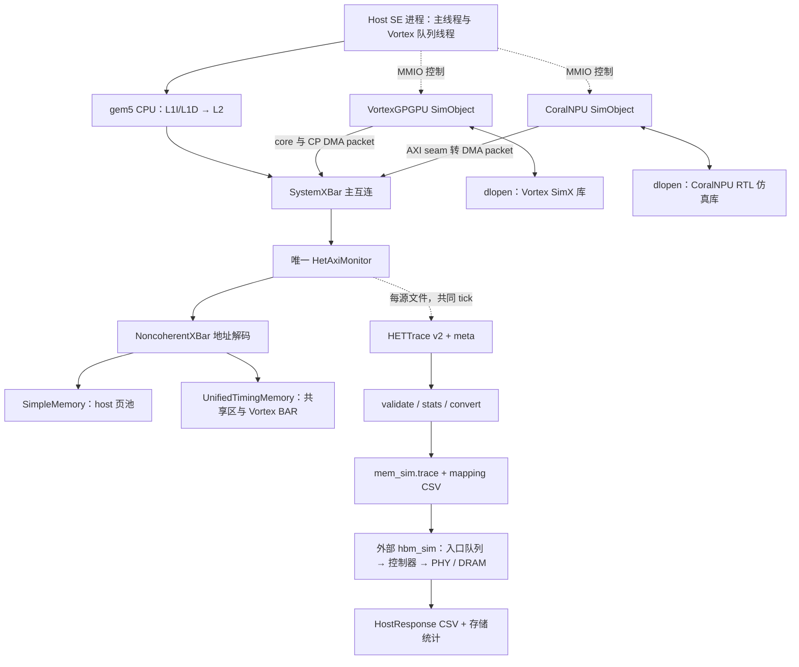

# 仿真器详细架构与运行机制

本文对应当前代码。读者可从[构建运行指南](08-build-run.md)复现，从
[协同机制](10-multi-device.md)追踪一项任务，从[实验方法](09-experiments.md)解释输出。

## 1. 层级与边界

系统包含功能仿真进程和独立的离线存储仿真进程。前者拥有程序与真实字节，后者消费已经固定
的请求流。它们通过文件交接；离线响应不触发 gem5 事件。

实线中的 memory request/response 都由 gem5 端口协议传递，图中为易读仅画出请求方向。
PIO 控制请求在主互连上分流到设备，不经过下游内存 monitor；因此统一 trace 不是全部 MMIO
命令日志。需要定位启动过程时同时查看 workload 日志。

## 2. 模块、状态所有权与源码入口

| 模块 | 输入、职责与输出 | 状态所有权 / 实现入口 |
|---|---|---|
| Host 与 SE CPU | 执行 x86 workload，准备数据、提交 GPU 队列、访问 NPU PIO、检查结果 | 进程页池、线程上下文；`workloads/three_source/host_main.cpp` |
| CPU cache 层次 | 私有 32 KiB L1I/L1D（8 路），共享 1 MiB L2（16 路）；过滤命中流量 | `gem5int/configs/het/het_system.py:build_cpus` |
| Vortex 适配层 | Host runtime/CP 提交与 SimX core 访存接入 DmaPort；响应完成后推进相应请求 | 上游 `sim/simx/gem5/`；项目补丁在 `vortexint/patches/` |
| CoralNPU 适配层 | 加载 ELF、PIO 状态机、按时钟调用设备库；AXI ID/byte-enable 与 DMA completion 关联 | `gem5int/src/dev/coralnpu/coralnpu_dev.{cc,hh}` |
| CoralNPU 设备库 | 包装 Verilator/RTL 与 AXI seam，提供扁平 C ABI，隔离 Bazel 与 SCons 类型依赖 | `coralnpuint/coralnpu_gem5.{cc,h}` |
| 主互连 | 仲裁 host 与设备请求；按范围路由 PIO 和内存 | gem5 `SystemXBar`；配置接线是拓扑真值 |
| 统一监视器 | 透明转发已接受的 packet，关联响应，确定性拆分 AXI burst，逐源写文件 | `gem5int/src/hettrace/het_axi_monitor.{cc,hh}` |
| 功能内存 | host 普通页用 SimpleMemory；共享区与 BAR 用按需分配 4 KiB 页的稀疏内存 | `gem5int/src/mem/unified_timing/`；真实字节唯一落点 |
| HETTrace writer | 64 B 文件头、56 B 记录、逐源序号、关闭时写 meta | `libhettrace/include/hettrace/`，header-only C++17 |
| 离线工具 | 校验时间/地址/因果，统计 W/R，稳定归并，生成请求与来源映射 | `tools/hettrace/` |
| hbm_sim | 消费请求，地址映射、队列调度、行策略、维护、行为级 PHY/DRAM 和响应输出 | 外部树 `src/{frontend,core,controller,dram,stats}/` |

`storage_chain/` 是单独运行的 RTL 透明边界与 checker 参考，未串入上述 gem5 执行路径。
Vortex 内含的 `third_party/ramulator` 仍是 SimX 构建/运行依赖，不能用它替代外部 hbm_sim。

## 3. 时间、请求接受与响应

gem5 事件队列统一掌握时间，时间基准为 `10^12 tick/s`。Host 2 GHz、Vortex 1 GHz、CoralNPU
500 MHz 分别对应 500、1000、2000 tick/cycle；设备库的一次 tick 调用推进一个设备周期后返回。
模拟的设备活动交错发生在同一事件线程，不能把模拟并发等同于多个宿主机线程并行执行。

CoralNPU issue callback 在地址/数据握手后建立请求上下文，携带 ID、地址、大小、写数据和 WSTRB。
DmaPort 发出 timing request。内存响应到达后，completion 回调向 RTL 注入 R/B；读数据来自
gem5 共享内存，同 ID 请求按设备适配器的退休队列处理。写请求的 byte-enable 直接更新有效 lane，
避免多生成一笔读改写。Vortex core/CP 也在 timing 模式下等待 gem5 completion。

监视器需要遵守 `sendTimingReq/recvTimingResp` 及 request/response retry：未被下游接受的请求
不能计数为新事务，重试不能重复记录；响应反压时保持 packet 与 sender state，直到传递完成。
`UnifiedTimingMemory` 的忙碌状态、response 队列和 retry 只提供可执行的功能延迟/带宽约束。
这些延迟确实能改变 gem5 trace，但不是最终 DRAM 参数校准结果。

Vortex 回归用 `--vortex-fast-forward` 先运行 AtomicSimpleCPU；首次 Vortex CP 写触发 CPU
切换并清零 gem5 stats，随后进入 TimingSimpleCPU。atomic 调用返回 delay 时 `curTick()` 不变，
monitor 将未来 B/R 暂存，按完成 tick 顺序写出，防止时间倒退。stats reset 不会截断 trace，
因此完整 trace 仍包含动态加载器与初始化流量。性能 ROI 必须另行明确，不能仅凭 stats reset
认定离线输入已裁剪。

## 4. 地址与数据所有权

| 物理区域 | 基址 / 大小 | 当前用途 |
|---|---|---|
| host_heap | `0x80000000` / 256 MiB | 唯一报告给 SE 的普通物理页池 |
| shared_buffer | `0x90000000` / 256 MiB | Host↔CoralNPU 输入与输出 |
| npu_work | `0xB0000000` / 256 MiB | NPU 工作数据，Host 可预置 |
| vortex_bar | `0x100000000` / 4 GiB | Host 与 Vortex 不同地址视图对应的统一字节 |
| vortex_cp / npu_pio | `0x20000000` / 512 B；`0x30000000` / 4 KiB | 控制与状态寄存器 |

`vortex_vram=0xA0000000` 是保留的设备地址视图，不是主配置中另建的一份 Host VRAM。
Vortex 物理访问采用 `BAR_base + device_address`；BAR 基址必须与上游 runtime `driver.h`
一致。CoralNPU 的 32 位地址不可达 4 GiB 以上 BAR，当前没有三方直连同一物理地址的共享区。

共享区与 MMIO 在 SE 中使用 `Process.map(..., cacheable=False)`，程序用 volatile load/store
完成显式交接。当前没有 DMA cache coherence、IOMMU 或 OS 驱动；仅在图上把地址画成一致，
不能证明字节共享正确。完整区域与修改约束见[地址图](01-address-map.md)。

## 5. 统一观察、转换与离线运行

monitor 根据 requestor 名匹配 CoralNPU、Vortex，其余默认归 Host。Vortex 请求有 stream ID
时归为 core，无 stream ID 时带 DMA flag。这个分类表目前针对三源硬编码，新增设备必须扩展它。
每个 packet 按对齐、总线宽度、4 KiB 边界与最多 256 拍拆分；五通道记录均标 `SYNTH`。
CoralNPU 当前 16 B 单拍 seam 可保留 ID/地址/WSTRB，其余五通道事件仍是 monitor 重构。

写事务产出 `AW + W×拍数 + B`，读事务产出 `AR + R×拍数`。`txn` 只在源内唯一，跨源关联
使用 `(src_id, txn)`；merge 使用稳定的时间/来源/源内序号顺序。格式不含 WDATA/RDATA。

`convert --preset memsim` 从 W 生成写请求以保存 mask，从 AR 展开读请求以保存发射 tick，
将 tick 用显式 `ticks_per_cycle` 量化。一个数据拍对应一个 HostRequest，若下游内部再切分为
DRAM transaction，应分别计数。逐行 mapping 是响应关联源、事务、拍号的依据。

hbm_sim 的前端按输入次序尝试提交到期请求，队列满时保留当前请求并逐周期重试；同周期可接受
多笔，不能描述成固定“一周期只注入一笔”。后续经过 stack/channel 路由、controller 队列与
调度器、行策略、timing/refresh、PHY/DRAM，完成后导出 HostResponse。这个过程不会改变原 trace
的后继请求或设备同步点。结果解释见[实验方法](09-experiments.md)。

## 6. 完整生命周期与排错入口

1. 配置解析参数、声明地址范围、创建 CPU/cache/设备/monitor/内存并接线。
2. `m5.instantiate()` 建立端口与运行对象；设备库加载/复位，内核预置到本地存储。
3. SE 映射共享与 PIO 窗口；Host 启动任务，设备周期与 DMA completion 在事件队列中交错。
4. workload 核对数据、mailbox 与事件；异常退出码或 tick 上限令回归失败。
5. monitor 关闭、刷新延迟记录并写 meta；独立 validate 检查完整性和来源。
6. 转换、离线重放、mapping/response 核对，保存输入清单、实际配置、执行命令与指标。

启动失败先看动态库路径、ABI 和参数头；数据错先查地址映射、byte-enable、完成顺序；
trace 错查唯一观察点和分类；存储未完成查队列、周期上限与 response ID，分层收敛故障。
