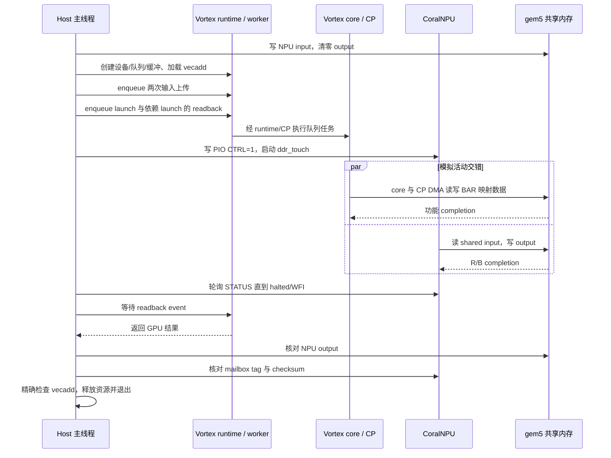

# Host、Vortex 与 CoralNPU 协同机制

当前协同由 Host workload 显式编排，没有自动图分区器或跨设备统一任务调度器。
真实三源回归执行 GPU vecadd 和 NPU 仿射变换；合成 LLM-like 流的任务划分是另一个访存实验，
不表示这三个设备已经执行完整 Transformer。

## 1. 职责与控制方式

| 参与者 | 本次任务 | 控制 / 完成机制 | 数据路径 |
|---|---|---|---|
| Host | 准备两份输入，创建设备队列，发任务，回收并精确验证结果 | x86 SE 主线程；Vortex runtime 队列 worker | 普通堆、uncacheable shared_buffer 与 BAR |
| Vortex | 4 个 FP32 元素的 `dst=src0+src1` | `vx_enqueue_write/launch/read`，launch/read event，`vx_event_wait_value` | Host runtime → BAR staging/CP DMA → device buffer → core |
| CoralNPU | 64 个 uint32 元素的 `out=in*2+1`，并写输入校验和 | PIO CTRL 一次启动，STATUS 轮询，mailbox 完成标记 | AXI master seam → gem5 DMA → shared_buffer |
| gem5 | 统一事件与共享字节，执行 timing request/response | CPU/设备周期与 completion event | SystemXBar → monitor → 统一功能内存 |
| hbm_sim | 对三源合并后的固定请求流做存储实验 | 文件输入；HostResponse 输出 | 与在线功能执行无回调连接 |

实现入口为 `workloads/three_source/host_main.cpp`、`coralnpuint/ddr_touch.cc`、
上游 Vortex `sw/runtime/` 和项目两套设备适配器。

## 2. 一次三源运行的工作链路



1. Host 把 NPU 的 64 个输入放在 `0x90000000`，清零 `0x90001000` 输出区，输入模式
   `0x1000*(i+1)+(i XOR 0x5A)` 避免未接通内存时全零误通过。
2. Host 在堆上准备 GPU 两路 FP32 输入，建立 Vortex device、queue、buffer 与 module，
   将设备 buffer 地址放入 kernel 参数结构体。该结构体必须匹配固定版本 vecadd ABI。
3. Host 先提交上传、launch，再提交依赖 launch event 的结果读回；此处不立即等待。
   runtime 的队列 worker 需要独立 SE 线程上下文，主配置默认 4 CPU，至少需要 2 个。
4. Host 紧接着写 NPU PIO CTRL。CoralNPU 从已加载 ELF 的 entry 开始工作；主配置关闭自动启动，
   确保输入先写好。启动为一次性，当前不验证同一实例反复 reset/重启。
5. Host 有界轮询 NPU halted/WFI，随后等 GPU readback event；两设备完成后逐字核对 NPU
   的 64 个输出，再检查 `mailbox[0]` 高 16 位为 `0x600D`、低 16 位等于输入和的低 16 位，
   并精确比较 GPU 全部 4 个结果。
6. 两套功能检查通过后 Host 输出 `host: 全部通过`。gem5 配置传播 Host 非零退出码并检测
   tick 上限；回归脚本还检查结果标记，避免只凭 gem5 进程返回 0 判断成功。

并发判据是 Vortex/CoralNPU 的 trace 活动区间有交集，且两源都实际发出数据请求。
区间重叠是粗粒度证据，不表示每个周期都有两个请求，也不证明计算单元全程同时繁忙；
分析争用需进一步看时间窗口流量、queue 和 response。

## 3. 两条真实数据交接

Host↔NPU：共享窗口是相同物理地址、同一份 `UnifiedTimingMemory` 字节。Host 的访问映射
为 uncacheable，NPU master 请求通过 DMA 到同一 responder。PIO/mailbox 管理启动和完成，
不承担大块数据复制。`--npu-no-share` 反向对照改用 NPU 私有 DDR，必须导致功能校验失败。

Host↔Vortex：Host 的普通虚拟堆不直接作为 GPU 物理地址。runtime 把数据传到 BAR staging，
CP DMA 搬入设备 buffer，core 用设备地址访问，适配器加 `0x100000000` 转为统一物理地址。
结果沿 CP/runtime 读回 Host。BAR 基址、窗口大小、设备地址宽度与 runtime 常量必须一致。
统一 monitor 对两侧都记录物理 BAR 地址，以此定位共享；DMA flag 区分 CP 搬运与 core 流量。

当前 CoralNPU 是 32 位 AXI，访问不到 4 GiB 以上的 BAR，所以两设备不能在当前地址图下直接
共享同一物理 buffer。若需要 `Vortex → CoralNPU` 结果依赖，标准编排是：

```text
等待 Vortex readback → Host 校验/格式转换 → 拷贝到 NPU shared input
→ 写 NPU CTRL → 等待状态/mailbox → Host 读取 NPU output
```

这是可扩展的软件链路说明，现有 `run_three_source.sh` 尚未实现此串行结果传递实验。
需要增加专门 workload 和守恒/功能验证；不能把并行 vecadd/仿射变换测试写成已经验证的设备流水线。
连续多批任务未来可以通过双缓冲将批间搬运与计算重叠，但也尚未实现。

## 4. 同步、所有权和异常

输入 buffer 在对应上传或设备读取完成前保持有效；输出只能在 completion/event/status 后读取。
单独使用 volatile 不提供系统级 DMA coherence，当前方案依赖 uncacheable 映射和显式同步。
若改为 cacheable，需补充一致性或 flush/invalidate 机制及反向对照。

| 故障 | 判据 / 处理 |
|---|---|
| Vortex API 失败 | `VXCHECK` 输出 API 与错误码，Host 返回 8 |
| GPU 结果错误 | 精确比较失败，Host 返回 7 |
| NPU 超时、输出错、tag 错、checksum 错、未启动 | Host 分别返回 2、3、4、5、6 |
| gem5 tick 耗尽 | 配置返回失败；不把截断 trace 当完整输入 |
| 地址或 mask 适配错误 | workload 功能对照与统一 trace 的区域/WSTRB 检查共同定位 |
| 离线请求未完成 | mapping/response ID 集合不等或时序检查失败；与在线功能失败分开报告 |

任务分配目前在 workload 中固定：GPU 做向量并行加法、NPU 做确定性整数变换、Host 控制和检查。
后续动态分配需先定义任务描述、依赖、数据布局、资源占用和失败回收，再增加调度器；
这些不是当前系统隐藏具备的能力。
